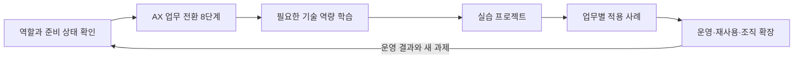

# AX Engineer Roadmap

[](LICENSE)
[](README.md)
[](CHANGELOG.md)
[](https://github.com/woogi-kang/ax-engineer-roadmap/actions/workflows/validate.yml)
[](https://github.com/woogi-kang/ax-engineer-roadmap/actions/workflows/codeql.yml)
[](https://woogi-kang.github.io/ax-engineer-roadmap/)

[한국어](README.md) | [English](en/README.md)

**AX Engineer**는 자동화하거나 AI로 보조할 업무를 찾고, 사람이 판단할 지점을 남겨 흐름을 다시 설계한 뒤, AI를 기존 데이터·시스템·권한 구조에 연결해 실제 운영까지 책임지는 엔지니어다.

이 저장소에서 **AX**는 조직의 업무 흐름을 AI로 다시 설계하고 운영 방식까지 바꾸는 **AI Transformation**을 뜻한다. 업계 전체에서 하나로 합의된 약어라고 전제하지 않는다.

이 저장소는 업무 선택과 재설계부터 배포·현업 적용·복구, 두 번째 업무에서의 재사용까지 순서대로 다룬다. 한국 조직에서 자주 마주치는 결재·권한·규제와 업무 기록·시스템 연동 조건도 함께 살핀다.

> AX 엔지니어의 일은 데모가 동작할 때 끝나지 않는다.
>
> 실제 사용자가 업무에 적용하고, 문제가 생기면 멈추거나 복구하며, 다른 사람이 이어서 운영할 수 있어야 한다.

## 이 로드맵에서 다루는 것

- **업무 전환 순서**: 문제와 경계 설정부터 업무 재설계, 데이터 연결, 통제, 배포, 현업 적용, 확장까지 8단계로 다룬다.
- **구현과 운영 기준**: 소프트웨어·LLM·평가·보안 역량을 실제 결과물, 승인, 기록, 복구 기준과 연결한다.
- **업무별 적용 사례**: 공통 업무와 6개 산업 맥락의 15개 사례에서 원본 시스템과 실행 범위를 비교한다.
- **외부 공개 사례 카탈로그**: 국내 10개, 해외 15개 사례에서 실제 업무 흐름, 사람의 판단 지점, 공개 성과와 근거 한계를 비교한다.
- **역할별 시작점**: 현직 AX 엔지니어와 준비하는 사람, 현업 실무자, 리더, 데이터·보안·운영 담당자가 결정하거나 확인할 내용을 구분한다.

## 지금 검증된 범위

| 자산 | 수량 | 공개 근거의 의미 |
|---|---:|---|
| 업무별 사례 | 15개 | 모두 문서·메타데이터 검사를 통과한 실습 설계 |
| 재현 가능한 공개 시뮬레이션 | 1개 | 합성 VOC 16건을 처리하는 코드·평가·runbook·해시 manifest를 깨끗한 디렉터리에서 재검증 |
| 실행 설계 | 14개 | 원본 시스템·승인·실패·복구를 설계했지만 실행 코드나 조직 운영 성과는 아직 없음 |
| 외부 공개 사례 | 국내 10개·해외 15개 | 공개 원문 26개를 출처·도입 단계·성과 검증의 세 축으로 분리 |

`ready`는 사례 문서가 실습에 사용할 수 있다는 뜻이다. 조직의 실제 도입, 운영 성과, 생산성·비용·매출 효과를 검증했다는 뜻이 아니다.

## 한 명령으로 검증하기

```bash
git clone https://github.com/woogi-kang/ax-engineer-roadmap.git
cd ax-engineer-roadmap
npm run verify
```

이 명령은 의존성과 Chromium을 설치한 뒤 문서·사례·보안 감사·Python 재현·사이트 렌더링·브라우저 접근성·Pages export를 CI와 같은 순서로 검사한다. Python 재현 단계의 `"verified": true`는 합성 입력·코드·커밋 산출물이 일치한다는 뜻이다.

- [내 역할과 조직 준비 상태로 시작점 찾기](https://woogi-kang.github.io/ax-engineer-roadmap/)
- [업무별 사례 15개 비교하기](case-studies/README.md)
- [국내외 공개 AX 사례 25개 살펴보기](research/public-ax-cases.md)

## 인터랙티브 로드맵으로 시작하기

[**인터랙티브 로드맵에서 시작점 찾기 →**](https://woogi-kang.github.io/ax-engineer-roadmap/)

1. [역할과 책임 범위](roadmap/role-model.md)에서 AX Engineer가 맡는 결정과 경계를 확인한다.
2. [조직 준비도 진단](start-here/organization-readiness.md)에서 현재 업무가 파일·메신저, SaaS, 사내 시스템 중 어디까지 준비됐는지 확인한다.
3. 아래 업무별 적용 사례에서 접근 가능한 데이터와 테스트 환경이 있는 사례를 하나 고른다.

[Markdown 시작 안내](start-here/README.md) · [사이트 실행 안내](site/README.md)

## 어떤 업무부터 자동화하거나 보조할까

익숙한 업무에서 사례 하나를 골라 시작한다. 사례 이름을 누르면 원본 시스템, 담당자 승인, 외부 시스템에 미치는 영향, 실패했을 때 복구하는 방법을 확인할 수 있다.

| 업무 영역 | 사례 | 시작 조건 | 설계 목표 경계 |
|---|---|---|---|
| 고객·매출 | [합성 VOC 반복 문제 → 개선 업무 제안](case-studies/beauty-d2c-voc/README.md) | 합성 VOC | 승인 후 샌드박스 쓰기 |
| 고객·매출 | [공공 민원 → 근거 답변·중복 묶음](case-studies/public-service-petition-response/README.md) | 합성 민원·정책 | 초안 전용 |
| 사람·협업 | [Slack 회의 → 실행 항목](case-studies/slack-meeting-actions/README.md) | SaaS 샌드박스 | 승인 후 기록 |
| 사람·협업 | [입사·이동·퇴사 계정·권한 관리](case-studies/employee-lifecycle-access/README.md) | HR·계정 샌드박스 | 역할별 승인 후 반영 |
| 재무·구매 | [법인카드 거래·영수증 → 전표 초안](case-studies/corporate-card-expense/README.md) | 합성 거래·증빙 | 초안 전용 |
| 재무·구매 | [전자세금계산서 발행·입금 대사](case-studies/electronic-tax-invoice-reconciliation/README.md) | 회계·ERP 샌드박스 | 승인 후 테스트 발행 |
| 재무·구매 | [거래처 등록·계좌 변경 검증](case-studies/vendor-master-account-change/README.md) | 거래처 마스터 샌드박스 | 이중 승인 후 반영 |
| 재무·구매 | [기업 자료 → 여신·인수심사 검토 초안](case-studies/credit-underwriting-review/README.md) | 합성 신청·심사 규칙 | 초안 전용 |
| 데이터·운영 | [파일·CSV → 검토 가능한 업무 허브(AX Hub)](case-studies/file-csv-to-ax-hub/README.md) | 파일·메신저 | 초안 전용 |
| 데이터·운영 | [재고 예외 → 발주·창고 이동안](case-studies/inventory-exception-replenishment/README.md) | ERP·WMS 샌드박스 | 승인 후 제안 기록 |
| 데이터·운영 | [설비 이상 → 정비 제안](case-studies/equipment-anomaly-maintenance/README.md) | 합성 센서·CMMS 샌드박스 | 승인 후 제안 기록 |
| 데이터·운영 | [상담·진료 대화 → 기록·위험 이관](case-studies/care-conversation-record/README.md) | 허구 대화·기록 샌드박스 | 초안·사람 이관 |
| 데이터·운영 | [근거 자료 → 출처 연결 규제 문서](case-studies/regulated-evidence-document/README.md) | 합성 계약·연구 자료 | 초안 전용 |
| 공통 운영 | [메일 분류·답변 초안](case-studies/centralized-mail-assist/README.md) | 메일 샌드박스 | 발송 전 승인 |
| 공통 운영 | [여러 업무 에이전트 운영](case-studies/company-agent-operating-layer/README.md) | 두 번째 업무·사내 API | 업무별로 제한 |

위 표의 마지막 열은 현재 구현이 아니라 **사례가 연습하도록 설계한 최대 경계**다. 현재 실행 범위와 목표 범위, 준비 상태, 난이도와 위험, P1~P5는 [전체 사례 비교표](case-studies/README.md)에서 따로 확인할 수 있다.

다른 조직이 공개한 사례에서 더 다양한 업무 후보를 찾고 싶다면 [공개 AX 사례 카탈로그](research/public-ax-cases.md)를 참고한다. [공개 사례 적용 맵](research/public-case-application-map.md)은 25개 공개 근거가 기존 10개와 신규 5개 실습에 어떻게 연결됐는지 보여 준다. 외부 발표는 참고 자료이며, 이 저장소가 해당 조직의 운영 성과를 검증했다는 뜻이 아니다.

## 로드맵 구성



1. [시작점 안내](start-here/README.md): 현재 맡은 책임과 업무 준비 상태를 확인한다.
2. [AX 업무 전환 8단계](delivery-lifecycle/README.md): 자동화하거나 AI로 보조할 업무를 찾고, 사람이 판단할 지점을 남겨 흐름을 다시 설계한 뒤 운영까지 연결한다.
3. [AX 엔지니어의 기술 역량](technical-foundations/README.md): 소프트웨어·LLM·에이전트·평가·운영·보안을 학습한다.
4. [실습 프로젝트](projects/README.md): 안전한 보조 도구를 만들고, 두 번째 업무에서 재사용할 부분까지 검증한다.
5. [업무별 적용 사례](case-studies/README.md): 준비 상태와 위험에 맞는 사례를 골라 P1~P5를 한 흐름으로 연습한다.
6. [운영과 조직 확장](organization-maturity/README.md): 여러 업무에서 같은 운영 능력을 반복할 수 있는지 확인한다.

## AX 업무 전환 8단계

8단계를 순서대로 밟되, 운영 결과나 새로운 제약이 발견되면 앞 단계로 돌아가 다시 확인한다.

| 단계 | 핵심 질문 | 문서 |
|---|---|---|
| 1. 목표와 경계 | 무엇을 자동화하거나 AI로 보조하고, 무엇은 사람이 판단하거나 직접 처리하는가? | [보기](delivery-lifecycle/01-outcomes-and-boundaries.md) |
| 2. 현재 업무 파악 | 실제 흐름과 병목은 어디에 있는가? | [보기](delivery-lifecycle/02-workflow-discovery.md) |
| 3. 업무 흐름 재설계 | 없애거나 단순화할 일을 그대로 자동화하고 있지 않은가? | [보기](delivery-lifecycle/03-process-redesign.md) |
| 4. 데이터와 업무 맥락 | 최신 상태를 어디에서 확인하며, 팀마다 용어를 같은 뜻으로 쓰는가? | [보기](delivery-lifecycle/04-data-and-context.md) |
| 5. 실행 규칙과 통제 | 입력·출력·권한·승인·기록·복구 기준은 무엇인가? | [보기](delivery-lifecycle/05-execution-contracts.md) |
| 6. 배포와 운영 | 프로토타입을 어떻게 안정적인 업무 시스템으로 옮기는가? | [보기](delivery-lifecycle/06-production-deployment.md) |
| 7. 현업 적용과 역할 전환 | 새 방식이 공식 업무로 자리 잡으려면 무엇이 바뀌어야 하는가? | [보기](delivery-lifecycle/07-adoption-and-change.md) |
| 8. 표준화와 확장 | 두 번째 업무에서도 실제로 재사용할 수 있는 것은 무엇인가? | [보기](delivery-lifecycle/08-standardization-and-scale.md) |

## 역량을 확인하는 다섯 질문

개념을 아는 것만으로는 역량을 확인하기 어렵다. 각 역량에 대해 아래 질문에 답할 수 있는지, 그 답을 결과물과 운영 기록으로 보여 줄 수 있는지 확인한다.

1. **이해** — 개념과 원리를 자신의 말로 설명할 수 있는가?
2. **선택** — 조건과 위험을 비교해 이 방법을 선택한 이유를 설명할 수 있는가?
3. **적용** — 실제 업무와 비슷한 데이터·권한·예외 조건에서 직접 적용했는가?
4. **검증** — 다른 사람이 검토하거나 재현할 수 있는 결과물과 기록을 남겼는가?
5. **실패 대응** — 자주 발생하는 오판과 실패를 발견하고, 필요할 때 중단하거나 복구할 수 있는가?

숙련도는 연차나 사용해 본 도구의 수보다 맡을 수 있는 배포·운영 책임으로 구분한다.

- **Foundation(기초)**: 업무를 구조화하고 제한된 프로토타입을 검증한다.
- **Builder(구현)**: 한 업무를 실제 운영 환경에 배포한다.
- **Operator(운영)**: 품질·비용·장애·권한과 현업 정착 상태를 계속 관리한다.
- **Lead(확장)**: 여러 업무에서 반복되는 규칙을 찾아 조직의 공통 운영 방식으로 만든다.

[역량 지도](roadmap/competency-map.md) · [숙련도 기준](roadmap/proficiency-levels.md)

## 어디서 시작할까

### AX 엔지니어 또는 이 직무를 준비하는 사람

1. [역할 모델](roadmap/role-model.md)에서 직무의 책임과 경계를 확인한다.
2. [조직 준비도 진단](start-here/organization-readiness.md)으로 첫 업무에서 가능한 범위를 정한다.
3. [기술 역량](technical-foundations/README.md)에서 부족한 영역을 찾는다.
4. [12주 실습 경로](learning-paths/12-week-practice.md)로 한 업무의 배포와 두 번째 업무의 재사용까지 연결한다.

### 함께 일하는 현업·리더·데이터·보안·운영 담당자

[협업 역할 안내](tracks/README.md)에서 자신이 결정하거나 제공해야 할 내용을 찾는다. 코드를 직접 작성하지 않더라도 업무 기준, 데이터 사용, 승인, 운영, 중단에 대한 책임은 역할별로 나뉜다.

### 기술 용어가 낯선 사람

[비개발자를 위한 AX 용어 안내](start-here/non-developer-glossary.md)에서 LLM, RAG, 에이전트(Agent), MCP, 평가, 로그, 수동 대체를 실제 업무 장면에 맞춰 설명한다.

## 공통 운영 기반(harness)은 언제 만드는가

**공통 운영 기반(harness)**: 여러 업무가 함께 지키는 최소 운영 규칙과 재사용 도구의 묶음이다.

팀마다 같은 모델·프레임워크·화면을 쓸 필요는 없다.

- 최신 데이터를 확인할 원본 시스템
- 입력·출력 형식과 업무 식별자
- 품질 기준과 담당자 승인
- 권한·변경·버전·감사 기록
- 실패 감지, 중단, 복구, 수동 처리
- 비용·품질·업무 결과 확인 방법

첫 업무의 구현을 곧바로 전사 표준으로 만들지는 않는다. 두 번째 업무에서도 실제로 재사용한 규칙과 도구만 공통 운영 기반에 포함한다.

## 다루지 않는 범위

- 특정 모델·클라우드·에이전트 프레임워크의 순위
- 모든 업무를 AI가 처리하는 조직 설계
- 하나의 에이전트에 전사 데이터와 권한을 집중하는 구조
- 확인되지 않은 생산성·비용·매출 개선 수치
- 자격증 과정이나 채용 보장

## 한국 조직에서 따로 확인할 것

업무 발굴, 재설계, 데이터 통합, 평가, 운영 원칙은 지역과 업종이 달라도 쓸 수 있다. 여기에 한국 조직에서 자주 확인해야 할 조건을 따로 더했다.

- 문서상의 결재선과 실제 의사결정권이 다른가?
- 개인정보와 AI 관련 현재 법령을 누가 확인하는가?
- 회사와 부서마다 데이터·API·조직 계정의 준비 정도가 얼마나 다른가?
- 도구 구매 뒤 공식 업무 절차와 책임까지 바뀌는가?
- 공급자를 바꾸거나 계약을 종료할 때 데이터와 업무를 되돌릴 수 있는가?

한국 기업 전체가 같은 방식으로 일한다고 가정하지 않는다. 다른 지역에서는 법률·조달·노사관계·조직 구조에 해당하는 조건을 현지 상황에 맞춰 바꿔 쓰면 된다.

## 공개 채용 자료에서 확인한 역할

`AX Engineer`는 아직 업계에서 하나로 굳어진 직함이 아니다. 2026-07-31에 확인한 국내 채용 자료에서는 업무 과제 분석, AI·데이터·클라우드 구현, 기존 시스템 연결, 평가·운영·보안, 사내 확산 책임이 서로 다른 조합으로 나타났다. 시점에 따라 바뀌는 공고 원문과 주장 범위는 [AX Engineer 공개 역할 검토](research/ax-engineer-role-review.md)에서 관리한다.

## 기여하기

[공개 AX 사례 카탈로그](research/public-ax-cases.md)는 국내외 25개 사례를 업무 흐름과 통제 관점에서 비교한다. [AX Engineer 공개 역할 검토](research/ax-engineer-role-review.md)는 현재 채용·현장 자료에서 반복되는 책임을 설명한다. [개발자·AI Agent 로드맵 검토](research/roadmap-benchmark-review.md)는 roadmap.sh에서 참고한 구조와 AX 관점에서 추가한 내용을 기록한다.

- 잘못되거나 오래된 내용은 `Source update` Issue로 제안한다.
- 빠진 역량이나 단계를 발견하면 `Roadmap gap` Issue를 연다.
- 실제 사례는 조직과 개인을 식별할 수 없게 정리한 뒤 `Case study proposal`로 제안한다.
- 모든 기여는 [기여 안내](CONTRIBUTING.md)와 [출처 정책](research/source-policy.md)을 따른다.

[지원과 질문](SUPPORT.md) · [보안 정책](SECURITY.md) · [프로젝트 운영](GOVERNANCE.md) · [행동강령](CODE_OF_CONDUCT.md) · [변경 기록](CHANGELOG.md) · [인용 정보](CITATION.cff)

## 이 프로젝트를 만든 이유

이 프로젝트는 제품 엔지니어로 일하며 AI 기능을 만드는 일과 조직의 실제 업무를 바꾸는 일 사이에 남는 간극을 정리하려고 시작했다. 유지관리자 [Woogi](https://github.com/woogi-kang)는 사례 문서와 실행물을 직접 만들고 검증하며, 공개 자료로 확인할 수 없는 조직 성과나 운영 경험은 시뮬레이션과 분리해 표시한다.

## 상태와 라이선스

- 최신 공개 릴리스: `v0.3.0`
- 다음 릴리스 후보: `v0.4.0`
- 기준일: `2026-08-01`
- 상태: `v0.4.0` 릴리스 준비본. 로컬 변경은 `main`에 반영되고 Pages 배포가 끝나기 전까지 공개 사이트에 나타나지 않는다.
- 적용 범위: 여러 조직에 적용할 AX 원칙과 한국 조직에서 확인할 조건
- 라이선스: [MIT](LICENSE)
