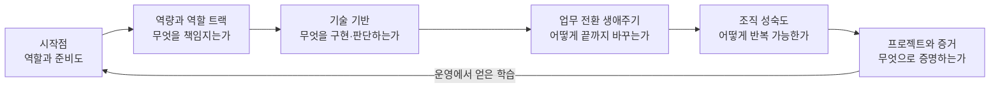

# AX Engineer Roadmap Korea

[](LICENSE)
[](README.md)
[](CHANGELOG.md)

[한국어](README.md) | [English](en/README.md)

한국 조직 안에서 AI를 실제 업무에 배포하고, 운영 가능한 변화로 정착시키는 **AX Engineer 실전 로드맵**이다. 개발자뿐 아니라 현업 실무자, 리더, 데이터·보안·운영 담당자도 자신의 책임에서 시작할 수 있다.

기술 목록만 나열하지 않는다. AX Engineer가 어떤 판단을 해야 하는지, 무엇을 직접 만들어야 하는지, 그 과정을 어떤 증거로 남겨야 하는지까지 연결한다.

> AX Engineer의 결과물은 데모가 아니다.
>
> 사람이 실제 업무에서 사용하고, 실패를 발견하고, 다른 사람이 이어서 운영할 수 있는 시스템과 작업 방식이다.

## 왜 이 로드맵을 만드는가

AI 도구를 도입했다고 조직의 업무가 저절로 바뀌지는 않는다. 팀마다 대시보드와 자동화를 만들어도 입력·출력·검증·기록 방식이 다르면 인수인계가 어렵고, 실패를 추적하거나 같은 방식을 다른 업무에 적용하기도 어렵다.

이 저장소에서 **AX Engineer**는 조직 내부의 업무 문제를 발견하고, 프로세스를 다시 설계하며, AI를 기존 데이터·시스템·권한 구조에 연결해 운영 가능한 변화로 만드는 엔지니어를 뜻한다. 직함의 표준 정의를 주장하기보다 다음 책임을 다루는 데 집중한다.

- 가치가 큰 업무와 실제 병목을 찾는다.
- 없애거나 단순화할 단계와 AI가 도울 단계를 구분한다.
- 데이터, 소프트웨어, 모델, 권한, 사람 승인을 하나의 업무 흐름으로 연결한다.
- 품질·비용·보안·장애·채택을 운영한다.
- 한 사례의 학습을 공통 기반과 조직의 작업 방식으로 확장한다.

[역할 모델 자세히 보기](roadmap/role-model.md)

## 이 로드맵이 말하는 조직 AI 운영체계

조직의 AI 운영체계는 모든 데이터와 권한을 하나의 슈퍼 에이전트에 모으는 시스템이 아니다. 각 팀이 필요한 도구와 구현 방식을 선택하더라도 결과를 안전하게 주고받고 운영할 수 있게 만드는 공통 기반이다.

최소한 다음 항목을 조직 차원에서 확인할 수 있어야 한다.

- 기준 데이터와 문서의 위치
- 입력·출력 규격과 업무 식별자
- 완료·품질 검증과 사람 승인 지점
- 권한·감사·변경·버전 기록
- 실패 탐지, 중단, 복구, 수동 대체 경로
- 비용·품질·채택·업무 결과의 운영 상태

따라서 AX의 목표 상태는 “모든 업무의 자동화”가 아니다. 조직이 새 업무를 발견하고, 안전하게 실험하고, 운영에 배포하고, 필요하면 중단하거나 개선할 수 있는 능력을 갖추는 것이다.

## 여섯 개의 지도

역할 선택, 기술 학습, 한 업무의 전환 과정, 조직 전체의 성숙도를 한 장에 섞지 않는다.



1. [시작점 진단](start-here/README.md): 역할과 조직 준비도에 따라 첫 문서를 고르는 안내
2. [직무 역량과 역할별 트랙](roadmap/competency-map.md): 공통 역량과 역할별 책임
3. [AX 기술 기반](technical-foundations/README.md): 소프트웨어·LLM·에이전트·평가·운영·보안
4. [8단계 업무 전환 생애주기](delivery-lifecycle/README.md): 한 업무를 운영 가능한 상태로 만드는 과정
5. [조직 AX 성숙도](organization-maturity/README.md): 개인 활용에서 자율적 개선 체계까지의 변화
6. [실습 프로젝트와 사례](projects/README.md): 안전한 보조부터 두 번째 업무 재사용까지 남기는 증거

[인터랙티브 로드맵 빌드 및 실행](site/README.md)

## 8단계 업무 전환 생애주기

8단계는 한 번만 통과하는 폭포수 절차가 아니다. 새로운 업무를 다룰 때마다 필요한 깊이만큼 반복해서 확인한다.

| 단계 | 핵심 질문 | 문서 |
|---|---|---|
| 1. 목표와 경계 | 무엇을 바꾸고 무엇은 AI에게 맡기지 않는가? | [보기](delivery-lifecycle/01-outcomes-and-boundaries.md) |
| 2. 업무 지도 | 실제 흐름과 병목은 어디에 있는가? | [보기](delivery-lifecycle/02-workflow-discovery.md) |
| 3. 프로세스 재설계 | 없애거나 단순화할 일을 자동화하고 있지는 않은가? | [보기](delivery-lifecycle/03-process-redesign.md) |
| 4. 데이터와 맥락 | 어떤 정보가 사실의 기준이며 용어는 같은 뜻인가? | [보기](delivery-lifecycle/04-data-and-context.md) |
| 5. 실행 계약과 통제 | 입력·출력·권한·승인·복구 기준은 무엇인가? | [보기](delivery-lifecycle/05-execution-contracts.md) |
| 6. 배포와 운영 | 프로토타입을 어떻게 안정적인 운영으로 옮기는가? | [보기](delivery-lifecycle/06-production-deployment.md) |
| 7. 채택과 역할 전환 | 새로운 방식이 공식 업무가 되려면 무엇이 바뀌어야 하는가? | [보기](delivery-lifecycle/07-adoption-and-change.md) |
| 8. 표준화와 확장 | 한 번의 성공을 어떻게 반복 가능한 조직 역량으로 만드는가? | [보기](delivery-lifecycle/08-standardization-and-scale.md) |

## 역량 항목을 읽는 방법

각 역량은 같은 형식을 따른다.

```text
알기       개념과 원리를 설명할 수 있는가
판단하기   조건과 위험에 따라 선택할 수 있는가
해보기     실제 업무와 비슷한 제약에서 수행했는가
증명하기   다른 사람이 확인할 결과와 기록이 있는가
실패 패턴  자주 발생하는 오판을 발견하고 피할 수 있는가
```

숙련도는 연차나 도구 개수보다 배포 책임의 범위로 구분한다.

- **Foundation**: 업무를 구조화하고 제한된 프로토타입을 검증한다.
- **Builder**: 한 업무를 실제 운영 환경에 배포한다.
- **Operator**: 품질·비용·장애·권한·채택을 지속해서 운영한다.
- **Lead**: 여러 업무에서 공통 패턴을 추출하고 조직 수준으로 확장한다.

[숙련도 기준 자세히 보기](roadmap/proficiency-levels.md)

## 어디서 시작할까

먼저 [시작점 안내](start-here/README.md)에서 역할과 조직 준비도를 확인한다. 직함이 아니라 이번 업무에서 실제로 내리는 결정으로 트랙을 고른다.

### 비개발 현업 실무자

1. [비개발자를 위한 용어 안내](start-here/non-developer-glossary.md)로 기술의 업무 경계를 확인한다.
2. [비개발 실무자 트랙](tracks/business-practitioner.md)에서 업무 정의·검수·SOP·채택 책임을 익힌다.
3. [안전한 보조 도구](projects/01-safe-assistant.md)로 외부 실행 없는 첫 증거를 만든다.

### 구현·통합을 맡는 AX Builder

1. [AX Builder 트랙](tracks/ax-builder.md)에서 배포 책임과 협업 경계를 확인한다.
2. [기술 기반](technical-foundations/README.md)에서 증거가 없는 영역을 찾는다.
3. 다섯 [실습 프로젝트](projects/README.md)와 [12주 실습 경로](learning-paths/12-week-practice.md)로 한 업무와 두 번째 재사용을 연결한다.

### AX 프로그램을 설계하는 리더

1. [리더·거버넌스 트랙](tracks/leader-and-governance.md)으로 우선순위·책임·조달·중단 기준을 정한다.
2. [조직 준비도](start-here/organization-readiness.md)와 [조직 성숙도](organization-maturity/README.md)를 구분해 진단한다.
3. [운영 파일럿](projects/04-production-pilot.md)과 [두 번째 업무 재사용](projects/05-second-workflow-reuse.md)의 증거 뒤에 공통 기반을 결정한다.

### 데이터·보안·운영 담당자

1. [데이터·보안·운영 트랙](tracks/data-security-operations.md)에서 수명주기 전체의 공동 설계 책임을 확인한다.
2. [샌드박스 통합](projects/03-sandbox-integration.md)에서 권한·중복·복구를 시험한다.
3. [실행 계약](toolkit/execution-contract.md)과 [근거 기록](toolkit/evidence-ledger.md)을 공통 작업 규격으로 사용한다.

## 첫 번째 공개 사례

[Beauty/D2C 글로벌 VOC → 업무 제안](case-studies/beauty-d2c-voc/README.md)은 공개 데이터로 연습할 수 있는 사례다.

```text
VOC 수집
→ 원문과 출처 보존
→ 이슈·기회 탐지
→ 근거 확인
→ 업무 제안
→ 사람 승인
→ 실행 결과 기록
```

특정 회사의 내부 진단이 아니다. 공개적으로 관찰 가능한 업무 구조를 바탕으로 만든 학습용 시뮬레이션이며, 확인한 사실과 가설을 구분한다.

## 프로젝트 원칙

- 업무에서 시작하고 플랫폼을 먼저 정하지 않는다.
- 같은 도구보다 입력·출력·검증·승인·기록·복구의 최소 계약을 맞춘다.
- 원본 시스템과 데이터 소유권을 존중한다.
- 자율성은 업무 위험과 복구 가능성에 따라 높인다.
- 모델 품질과 사업 결과를 따로 측정한다.
- 기존 수동 절차의 종료 또는 유지 조건까지 설계한다.
- 현장 근거 없이 효과를 단정하지 않는다.
- 한 사례에서 검증되지 않은 구조를 전사 표준으로 만들지 않는다.

## 다루지 않는 것

- 외부 고객 환경에 제품을 배포하는 직무의 커리어 로드맵
- 특정 모델·클라우드·에이전트 프레임워크의 순위
- 모든 업무를 AI가 수행하는 청사진
- 하나의 슈퍼 에이전트에 전사 데이터와 권한을 집중하는 구조
- 출처 없는 생산성·비용·매출 개선 수치
- 자격증 과정이나 채용 보장

## 근거와 기여

[AX Engineer 공개 역할 검토](research/ax-engineer-role-review.md)는 현재 채용·현장 자료에서 반복되는 책임을 설명한다. [개발자·AI Agent 로드맵 검토](research/roadmap-benchmark-review.md)는 roadmap.sh에서 가져온 구조와 AX 관점에서 보완한 영역, 한국 조직의 적용 조건을 기록한다. 로드맵의 빈 영역, 반례, 실제 배포 사례, 더 나은 검증 방법에 대한 기여를 환영한다.

- 잘못되거나 오래된 내용은 `Source update` Issue로 제안한다.
- 빠진 역량이나 단계를 발견하면 `Roadmap gap` Issue를 연다.
- 사례는 조직과 개인을 식별할 수 없게 정리한 뒤 `Case study proposal`로 제안한다.
- 모든 기여는 [기여 안내](CONTRIBUTING.md)와 [출처 정책](research/source-policy.md)을 따른다.

## 상태와 라이선스

- 현재 버전: `v0.2.0`
- 기준일: `2026-07-26`
- 상태: 다중 역할·조직 준비도·기술 기반·증거 프로젝트를 포함한 공개본
- 라이선스: [MIT](LICENSE)
