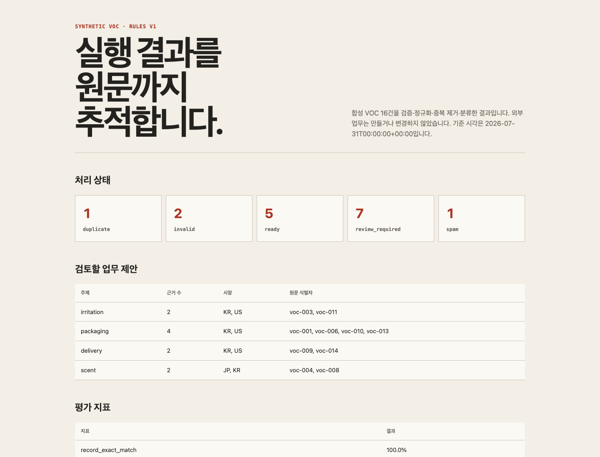

# 사례: Beauty/D2C 글로벌 VOC 분석에서 업무 제안까지

<!-- case-boundary:start -->
## 현재 범위와 설계 목표

| 구분 | 쓰기 영향 | 자율성 | P 단계 |
|---|---|---|---|
| 현재 공개 실행물 | 외부 쓰기 없음 | A1-A2 | P1 |
| 설계 목표 | 승인 후 샌드박스 쓰기 | A1-A3 | P1, P2, P3, P5 |

현재 값은 이 저장소에서 재현할 수 있는 범위만 나타낸다. 설계 목표는 아직 구현 범위나 조직 운영 성과가 아니다.
<!-- case-boundary:end -->

> 공개 사례 연결: K04의 상담사 검토와 G07의 편집 승인·수정률 질문을 [공개 사례 적용 맵](../../research/public-case-application-map.md)에서 이 사례의 평가 기준으로 연결했다.

## 사례 성격

이 문서는 특정 회사의 내부 진단이나 컨설팅 결과가 아니다. 공개 사례에서는 평가 질문만 가져오고, 실제 실행 입력은 합성 VOC와 일반적인 Beauty/D2C 업무 구조로 만든 **학습용 AX 업무 전환 시뮬레이션**이다.

## 현재 실행물과 근거

이 사례에는 설계 문서뿐 아니라 합성 VOC 16건을 실제로 처리하는 재현 가능한 파이프라인이 포함돼 있다. Python 표준 라이브러리만 사용하며 외부 API나 모델을 호출하지 않는다.



| 실행 항목 | 현재 결과 |
|---|---|
| 입력 | 중복·필수값 누락·스팸·혼합 언어·오래된 데이터·안전 신호를 포함한 합성 VOC 16건 |
| 처리 | 검증 → 정규화 → 중복 제거 → 규칙 기반 주제 분류 → 수동 검토 큐 → 업무 제안 |
| 상태 | 정상 5건, 수동 검토 7건, 무효 2건, 중복 1건, 스팸 1건 |
| 제안 | 원문 식별자를 포함한 검토용 제안 4건. 외부 업무 생성·변경 없음 |
| 평가 | 기대 상태·주제·안전 신호 16건 전체 일치, 원문 추적률 100% |

[실행 방법과 복구 절차](RUNBOOK.md) · [평가 결과](artifacts/evaluation-report.md) · [대시보드 HTML](artifacts/dashboard.html) · [실행 파일 해시](artifacts/run-manifest.json)

이 수치는 합성 평가 세트가 코드대로 처리됐는지를 보여 줄 뿐, 실제 고객 VOC 분포나 실서비스 분류 성능·업무 성과를 뜻하지 않는다.

현재 실행물의 경계는 `current_autonomy=A1-A2`, `current_write_impact=none`, `implemented_project_stages=[1]`이다. 승인 뒤 샌드박스에 쓰는 A3와 P2·P3·P5는 이 문서가 설계한 다음 실습 범위이며 아직 구현됐다는 뜻이 아니다.

## 문제 가설

글로벌 소비자 리뷰와 문의는 여러 국가·언어·채널에 흩어져 있다. 마케팅·제품·CS·운영 담당자는 비슷한 조사를 반복하지만, 결과의 출처·기간·표본·분류 기준이 다르면 다른 팀이 이어서 사용하기 어렵다.

초기 가설:

> 원문과 수집 범위를 보존하면서 반복 이슈와 기회를 탐지하고, 사람이 근거를 확인한 뒤 업무 제안을 승인하게 하면 조사·인수인계의 일관성을 높일 수 있다.

이 가설은 실제 회사의 시간·품질·매출이 개선됐다는 뜻이 아니다. 공개 데이터로 시스템 품질과 실제 운영에 필요한 조건을 검증한 뒤, 현업 기준선이 있는 환경에서 다시 확인해야 한다.

## 사용자

| 사용자 | 필요한 결과 | 책임 |
|---|---|---|
| VOC 분석 담당자 | 반복 이슈와 근거 원문 | 수집 범위·분류 검토 |
| 마케팅·제품 담당자 | 실행 가능한 기회와 영향 범위 | 업무 우선순위 판단 |
| CS·운영 담당자 | 고객 불만과 예외 흐름 | 대응·운영 영향 확인 |
| 업무 책임자 | 승인 가능한 제안과 비용·위험 | 실행·중단 결정 |

## 포함 범위

```text
합성 VOC 파일 수집
→ 원문·출처·시간·채널 보존
→ 언어·상품·주제 정규화
→ 반복 이슈·기회 탐지
→ 담당자 근거 확인
→ 업무 제안 생성
→ 담당자 승인
→ 실행 상태와 결과 기록
```

실행 코드는 현재 `업무 제안 생성`까지 구현한다. 담당자 승인과 내부 업무 생성은 외부 시스템을 바꾸는 단계이므로 이 공개 실행물에서는 수행하지 않고 `requires_human_approval=true`, `action_boundary=proposal_only`로 기록한다.

## 초기 제외

- 개인을 식별할 수 있는 고객 데이터
- 가격·할인·재고·발주의 자동 변경
- 효능·규제 문구의 자동 게시
- 고객 계정으로 외부 메시지 자동 발송
- 공개 데이터만으로 실제 매출 효과 추정

## 데이터 계약

| 필드 | 의미 | 필수 | 품질 확인 |
|---|---|---:|---|
| `source_id` | 원본 리뷰·문의 식별자 | 예 | 중복 여부 |
| `source_type` | 공개·합성 등 입력 출처 유형 | 예 | 허용한 수집 경로 |
| `source_url` | 원문 위치 또는 합성 fixture 식별 URL | 예 | HTTPS 형식·`source_type` 일치 |
| `captured_at` | 수집 시각 | 예 | 시간대 |
| `published_at` | 원문 게시 시각 | 선택 | 누락 구분 |
| `market` | 국가·시장 | 예 | 코드 표준 |
| `channel` | 리뷰·문의 채널 | 예 | 허용값 |
| `product_id` | 상품 식별자 | 선택 | 매핑 근거 |
| `language` | 원문 언어 | 예 | 탐지 신뢰도 |
| `text_original` | 원문 | 예 | 빈 값·잘림 |
| `text_normalized` | 분석용 정규화문 | 선택 | 변환 버전 |
| `topic` | 주제 분류 | 선택 | 모델·규칙 버전 |
| `evidence_ref` | 제안과 원문 연결 | 출력에서 생성 | `source_id`까지 역추적 가능 |

기계 검증 규격은 [`voc-record.schema.json`](schemas/voc-record.schema.json), 합성 입력은 [`voc-sample.jsonl`](data/input/voc-sample.jsonl)에 있다. 실제 공개 데이터를 연결하는 수집 어댑터는 포함하지 않았다. 출처별 이용 약관·라이선스·개인정보 조건을 확인하지 않은 수집을 실행물처럼 포장하지 않기 위해서다.

## 수집·정규화·분류 파이프라인

```bash
python3 case-studies/beauty-d2c-voc/pipeline/run_pipeline.py
```

[`run_pipeline.py`](pipeline/run_pipeline.py)는 다음 순서로 실행된다.

1. 필수 필드, 허용값, URL·시간 형식을 확인하고 조건에 맞지 않는 레코드는 `invalid`로 분리한다.
2. Unicode NFKC, 소문자화, 공백 정리로 분석용 문장을 만들되 원문은 그대로 보존한다.
3. 시장·상품·채널·정규화문이 같은 레코드는 첫 원문을 남기고 `duplicate_of`를 기록한다.
4. 명시한 키워드 규칙으로 포장·배송·향·자극·제품 효과를 분류한다.
5. 상품·게시 시각 누락, 혼합 언어, 오래된 데이터, 미분류, 안전 신호를 `review_required`로 보낸다.
6. 근거가 두 건 이상이거나 안전 신호가 있는 주제만 제안 후보로 만들고 원문 식별자를 연결한다.

이 분류기는 다국어 모델의 대안이 아니라 데이터 계약, 실패 처리, 평가, 원문 추적 경로를 재현하는 결정론적 기준선이다.

## 업무 실행 규칙

### 입력

- 데이터 계약을 통과한 공개 VOC
- 분석 기간·시장·채널·상품 범위
- 주제·심각도·기회 판정 기준

### 출력

- 이슈 또는 기회 제목
- 근거 원문 목록과 출처
- 관찰한 빈도와 범위
- 표본·누락·언어 한계
- 제안할 업무와 담당 후보
- 승인·보류·기각 상태

### 자율성

- 수집·정규화·분류: A1~A2
- 이슈·기회 제안: A2
- 내부 업무 생성: A3
- 외부 게시·가격·재고 변경: 초기 범위 밖

## 평가

정상 사례만으로 품질을 판단하지 않는다.

- 같은 내용의 중복 리뷰
- 원문이 삭제되거나 접근할 수 없는 사례
- 여러 언어가 섞인 사례
- 상품명이 누락되거나 잘못 연결된 사례
- 빈도가 높지만 영향이 작은 이슈
- 빈도는 낮지만 안전·규제 위험이 큰 이슈
- 홍보성·무관·스팸 콘텐츠
- 오래된 데이터가 최근 이슈처럼 보이는 사례

평가 축:

- 원문 추적 여부
- 분류 정확성과 미분류 처리
- 근거 없는 주장 비율
- 담당자 수정 유형
- 처리 시간과 재작업
- 승인·보류·기각 이유

현재 합성 평가 결과는 [`evaluation.json`](artifacts/evaluation.json)과 [`evaluation-report.md`](artifacts/evaluation-report.md)에 기록한다. 기대 결과는 [`expected.jsonl`](data/evaluation/expected.jsonl)에 고정해 코드나 규칙을 바꿀 때 회귀를 확인한다.

```bash
python3 -m unittest discover \
  -s case-studies/beauty-d2c-voc/tests \
  -p 'test_*.py' \
  -v
```

현재 테스트는 정규화, 무효 입력, 중복, 안전 신호, 누락 필드, 전체 평가 세트, 결과 파일 생성을 확인한다.

## 실서비스로 확장할 때의 4주 검증 계획

### 1주차

- 공개 데이터 범위와 수집 한계 확정
- 현재 분석 흐름과 기준선 작성
- 데이터 계약과 평가 사례 준비

### 2주차

- 원문을 추적할 수 있는 분류·요약 기능 구현
- 담당자 검토 화면 또는 산출물 규격 작성
- 오류·누락·중복 평가

### 3주차

- 승인된 제안으로 내부 업무를 생성하는 흐름 연결
- 권한·중복 방지·감사 기록·복구 구현
- 운영 상태와 비용 확인

### 4주차

- 외부 검토자 또는 운영자의 사용성 검수
- 수정 부담·신뢰·업무 완료 여부 기록
- 재사용할 실행 규칙과 버릴 추상화 결정

## 현재 공개한 결과물

- [합성 입력 데이터와 수집 범위](data/input/voc-sample.jsonl)
- [데이터 스키마](schemas/voc-record.schema.json)
- [수집·정규화·분류 코드](pipeline/run_pipeline.py)
- [분류 결과](artifacts/classified-records.jsonl)
- [수동 검토 큐](artifacts/review-queue.json)
- [원문 근거를 포함한 업무 제안](artifacts/workflow-proposals.json)
- [평가 데이터와 실행 결과](artifacts/evaluation-report.md)
- [실행·실패·복구 절차](RUNBOOK.md)
- [결과 대시보드](artifacts/dashboard.html)
- [입력·코드·파이프라인 생성물 SHA-256과 수동 표시 자산 구분](artifacts/run-manifest.json)

## 결과와 한계

현재 실행물은 “합성 입력을 같은 코드로 다시 처리하고, 실패·중복·누락을 분리하며, 제안에서 원문까지 돌아갈 수 있는가”를 확인했다. 공개 사이트 수집, 실제 다국어 모델, 담당자 승인, 업무 시스템 연동, 장기 운영은 아직 검증하지 않았다.

따라서 이 결과로 실제 고객 불만의 비율, 분류 모델의 일반화 성능, 처리 시간 절감, 제품 개선, 매출 효과를 주장하지 않는다. 다음 단계는 이용 조건을 확인한 공개 데이터에서 같은 계약을 시험한 뒤, 실제 담당자가 검토한 수정 유형과 보류·기각 이유를 평가 세트에 추가하는 것이다.

## 남은 질문

- 공개 데이터가 실제 내부 VOC 구성을 얼마나 대표하는가?
- 언어·시장별 수집 편향을 어떻게 표현할 것인가?
- 제안이 실제 업무로 이어졌는지 무엇으로 확인할 것인가?
- 여러 부서가 같은 이슈를 다르게 해석할 때 최종 기준은 누구에게 있는가?
- 두 번째 업무에서 어떤 실행 규칙과 구성 요소를 재사용할 수 있는가?
