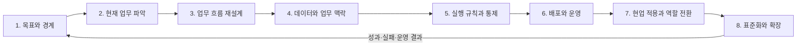

# AX 업무 전환 8단계

## 목적

한 업무를 고르는 시점부터 운영과 재사용까지 이어 가는 과정을 여덟 단계로 정리한다.

검증된 산업 표준이나 인증 기준은 아니다. AX 업무에서 자주 빠지는 결정과 결과물을 점검하기 위해 이 저장소가 제안하는 작업 순서다. 순서대로 진행하되 운영 결과나 새로운 제약이 발견되면 앞 단계로 돌아간다.

## 사용하는 방법

- 처음부터 모든 단계를 자세히 문서화할 필요는 없다.
- 위험이 낮은 업무는 범위를 작게 잡고 빠르게 검증한다.
- 데이터·권한·복구가 준비되지 않으면 자율 실행 범위를 높이지 않는다.
- 운영 중 새 제약이 발견되면 앞 단계로 돌아간다.
- 통과 기준을 충족하지 못한 단계가 있다면 구현 범위를 줄이거나 보류한다.

## 단계

1. [목표와 경계](01-outcomes-and-boundaries.md)
2. [현재 업무 파악](02-workflow-discovery.md)
3. [업무 흐름 재설계](03-process-redesign.md)
4. [데이터와 업무 맥락](04-data-and-context.md)
5. [실행 규칙과 통제](05-execution-contracts.md)
6. [배포와 운영](06-production-deployment.md)
7. [현업 적용과 역할 전환](07-adoption-and-change.md)
8. [표준화와 확장](08-standardization-and-scale.md)

## 공통 완료 질문

- 누가 이 업무 결과를 사용하고 최종 책임지는가?
- 입력과 출력은 다른 사람이 확인할 수 있는가?
- AI가 하지 못하는 행동과 담당자 승인 지점이 분명한가?
- 실패를 탐지하고 중단·복구할 수 있는가?
- 기존 업무보다 나아졌다는 근거가 있는가?
- 운영 책임을 다른 사람에게 넘길 수 있는가?
- 다음 업무에서 재사용할 부분과 버릴 부분을 구분했는가?
