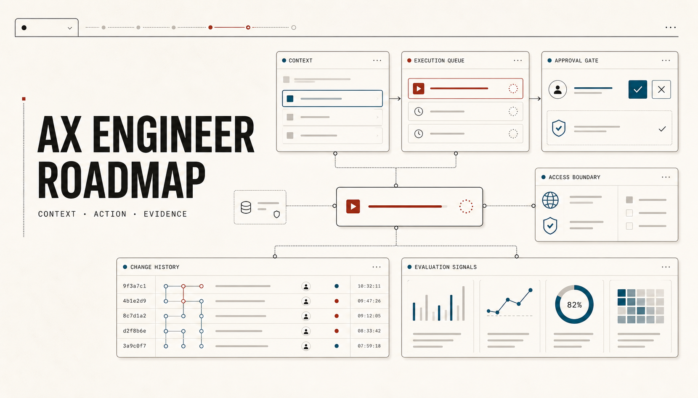
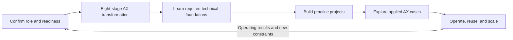

# AX Engineer Roadmap

[한국어](../README.md) | [English](README.md)

A practical roadmap for AX Engineers who need to choose a workflow, connect AI to existing data and systems, and carry the change into operations. It also covers approval, authority, regulation, and digital-readiness conditions commonly encountered in Korean organizations.

The primary audience is practicing and aspiring AX Engineers. Business practitioners, leaders, and data, security, and operations partners can use the collaboration guides to understand the decisions they own with an AX Engineer.

> An AX Engineer's work does not end when the demo runs.
>
> The workflow must be usable in real work, stoppable and recoverable when it fails, and operable by someone other than its original builder.

## What work can you transform with AX?

Start with one case in a work area you already know. Open a case to see its systems of record, human approvals, external impact, and recovery path.

| Work area | Case | Starting condition | Action boundary |
|---|---|---|---|
| Customer and revenue | [Public VOC issues → improvement proposals](case-studies/beauty-d2c-voc/README.md) | Public data | Read and propose |
| Customer and revenue | [Electronic tax invoice issuance and payment reconciliation](case-studies/electronic-tax-invoice-reconciliation/README.md) | Accounting and ERP sandbox | Approved test issuance |
| People and collaboration | [Slack meetings → action items](case-studies/slack-meeting-actions/README.md) | SaaS sandboxes | Write after approval |
| People and collaboration | [Joiner, mover, and leaver access](case-studies/employee-lifecycle-access/README.md) | HR and identity sandboxes | Role-based approval |
| Finance and procurement | [Card transactions and receipts → journal-entry drafts](case-studies/corporate-card-expense/README.md) | Synthetic transactions and evidence | Draft only |
| Finance and procurement | [Vendor onboarding and bank-account change validation](case-studies/vendor-master-account-change/README.md) | Vendor-master sandbox | Dual approval |
| Data and operations | [Files and CSVs → reviewable AX Hub](case-studies/file-csv-to-ax-hub/README.md) | Files and messaging | Draft only |
| Data and operations | [Inventory exceptions → purchase and transfer proposals](case-studies/inventory-exception-replenishment/README.md) | ERP and WMS sandboxes | Record approved proposals |
| Shared operations | [Mail classification and response drafts](case-studies/centralized-mail-assist/README.md) | Mail sandbox | Approval before sending |
| Shared operations | [Multi-workflow agent operations](case-studies/company-agent-operating-layer/README.md) | Second workflow and internal APIs | Bounded by workflow |

All cases are public or synthetic simulations or simulation designs. Compare readiness, risk, P1–P5, and current evidence in the [full case catalog](case-studies/README.md).

## Why AX Engineers now?

`AX Engineer` is not yet a standardized title. Recent Korean employers have nevertheless recruited people to redesign workflows, connect AI to existing systems and data, evaluate and operate agents, and help teams adopt them in real work. To keep the signal precise, the table below includes only postings that use `AX Engineer` in the job title.

| Company | Recent posting | AX work signal | Posting status |
|---|---|---|---|
| Daewoong · WELDA | [AX Engineer (3–8 years)](https://www.wanted.co.kr/wd/364116) | End-to-end automation, multi-agent systems, harness engineering, and workflow adoption | Always open |
| Lunit | [Senior AX Engineer](https://www.wanted.co.kr/wd/368564) | Slack approvals, domain agents, SaaS data integration, and a platform SDK | Always open |
| Liner | [AX Engineer (Internal)](https://www.wanted.co.kr/wd/353689) | Internal workflow redesign, agent harnesses, RAG and evaluation, deployment and observability | Always open |
| AIRS Medical | [AX Engineer](https://www.wanted.co.kr/wd/361768) | A central data layer, MCP and workflow builders, cross-functional redesign, and enablement | Always open |
| Egoism | [AX Engineer](https://www.wanted.co.kr/wd/350984) | Operational bottleneck discovery, automation, internal tools, and outcome measurement | Always open |

> **Snapshot as of 2026-07-31.** Postings change and close, so check the original page before applying. Adjacent roles may use titles such as `AI Agent Engineer`, `AI/ML Engineer`, `LLM Engineer`, `FDE`, or `DX Engineer`, but they are not included in this table.

## What an AX Engineer does

In this repository, an **AX Engineer** discovers organizational workflow problems, redesigns the flow, and connects AI to existing data, systems, and authority boundaries. Titles and exact scope vary by organization, but the roadmap focuses on five recurring responsibilities:

- find valuable workflows and their actual bottlenecks;
- separate steps to remove or simplify from steps where AI can help;
- connect data, software, models, permissions, and accountable approval in one workflow;
- operate quality, cost, security, incidents, and adoption;
- test which rules and components can be reused in a second workflow.

[Read the detailed role model](roadmap/role-model.md)

## Roadmap structure

1. [Starting point](start-here/README.md): confirm your responsibility and the workflow's current readiness.
2. [Eight-stage AX transformation](delivery-lifecycle/README.md): move one workflow from discovery and redesign into operations.
3. [Technical foundations for AX Engineers](technical-foundations/README.md): learn software, LLMs, agents, evaluation, operations, and security.
4. [Practice projects](projects/README.md): progress from a safe assistant to reuse in a second workflow.
5. [Applied AX cases](case-studies/README.md): choose a case by readiness and risk, then practice P1–P5 as one flow.
6. [Operations and organizational scale](organization-maturity/README.md): assess whether the organization can repeat the same operating capability across workflows.

[Open the interactive roadmap](https://woogi-kang.github.io/ax-engineer-roadmap/en/) · [Run the site locally](../site/README.md)

## Eight-stage AX workflow transformation

Proceed through the stages in order, returning to an earlier stage when operating results or new constraints require it.

| Stage | Core question | Document |
|---|---|---|
| 1. Goals and boundaries | What will change, and what must AI not do? | [Open](delivery-lifecycle/01-outcomes-and-boundaries.md) |
| 2. Understand the current workflow | How does the work actually flow, and where does it stall? | [Open](delivery-lifecycle/02-workflow-discovery.md) |
| 3. Workflow redesign | Are we automating work that should be removed or simplified? | [Open](delivery-lifecycle/03-process-redesign.md) |
| 4. Data and workflow context | Which systems hold current state, and do teams use terms consistently? | [Open](delivery-lifecycle/04-data-and-context.md) |
| 5. Execution rules and controls | What are the rules for input, output, authority, approval, records, and recovery? | [Open](delivery-lifecycle/05-execution-contracts.md) |
| 6. Deployment and operations | How does the prototype become a dependable workflow system? | [Open](delivery-lifecycle/06-production-deployment.md) |
| 7. Workflow transition and role change | What must change for the new flow to become official work? | [Open](delivery-lifecycle/07-adoption-and-change.md) |
| 8. Standardization and scale | What is actually reusable in a second workflow? | [Open](delivery-lifecycle/08-standardization-and-scale.md) |

## Five questions for assessing a competency

Knowing the concepts is not enough. For each competency, answer the following questions and support the answers with deliverables or operating records.

1. **Understand** — Can you explain the concepts and principles in your own words?
2. **Choose** — Can you explain why you chose an approach after comparing its constraints and risks?
3. **Apply** — Have you applied it under realistic data, authority, and exception conditions?
4. **Verify** — Did you leave a result or record that another person can review or reproduce?
5. **Handle failure** — Can you recognize common mistakes and failures, then stop or recover when needed?

Proficiency is based on delivery and operating responsibility rather than tenure or the number of tools used.

- **Foundation**: structure a workflow and validate a bounded prototype.
- **Builder**: deploy one workflow into a real operating environment.
- **Operator**: manage quality, cost, incidents, authority, and adoption over time.
- **Lead**: turn patterns repeated across workflows into shared organizational capability.

[Competency map](roadmap/competency-map.md) · [Proficiency levels](roadmap/proficiency-levels.md)

## Where to start

### Practicing or aspiring AX Engineer

1. Review the [role model](roadmap/role-model.md) and its responsibility boundaries.
2. Use the [organization readiness diagnostic](start-here/organization-readiness.md) to bound the first workflow.
3. Find gaps in the [technical foundations](technical-foundations/README.md).
4. Use the [12-week practice path](learning-paths/12-week-practice.md) to deploy one workflow and test reuse in a second.

### Business, leadership, data, security, and operations partners

Use the [collaboration role guides](tracks/README.md) to identify the decisions and deliverables you own with an AX Engineer. Writing code is not required, but responsibility for workflow criteria, data use, approval, operations, and stopping conditions still needs a named owner.

### Readers new to AI terminology

The [non-developer glossary](start-here/non-developer-glossary.md) explains LLMs, RAG, agents, MCP, evaluation, logs, and manual fallback through workflow decisions and risks.

## When to build a shared harness

Teams do not need to use the same model, framework, or interface. They do need compatible rules for:

- authoritative systems for current data;
- input and output formats and workflow identifiers;
- quality criteria and accountable approval;
- permission, change, version, and audit records;
- failure detection, stop, recovery, and manual handling;
- cost, quality, and workflow outcome review.

Do not turn the first implementation into an enterprise standard. Add only the rules and tools that are actually reused in a second workflow to the shared harness.

## What this roadmap does not cover

- rankings of models, clouds, or agent frameworks;
- an organization design in which AI performs every task;
- concentrating enterprise data and authority in one agent;
- unverified productivity, cost, or revenue claims;
- certification programs or hiring guarantees.

## How Korean organizational context is handled

Workflow discovery, redesign, integration, evaluation, and operations principles can travel across regions and industries. This repository adds conditions that often require explicit attention in Korean organizations:

- Does the formal approval line match actual decision authority?
- Who verifies current privacy and AI requirements?
- How different are data, API, and organization-account readiness across companies and teams?
- Does a tool purchase lead to changes in official procedure and accountability?
- Can data and work return safely when a vendor changes or a contract ends?

The roadmap does not treat Korean companies as one culture. Readers elsewhere can replace legal, procurement, labor, and organizational conditions with their local context.

## How to read the cases

The quick list above helps you begin with familiar work. The [case catalog](case-studies/README.md) compares difficulty, readiness, risk, write impact, P1–P5, and current evidence.

Do not infer a named company's internal diagnosis, live adoption, or productivity, cost, or revenue improvement from a case title. Each document states its current result and limits separately.

## Contributing

[AX Engineer public role review](research/ax-engineer-role-review.md) summarizes recurring responsibilities in current role and practitioner material. [Developer and AI Agents roadmap review](research/roadmap-benchmark-review.md) records what this project borrows from roadmap.sh and what it adds for AX work.

- Propose outdated or incorrect material through a `Source update` issue.
- Open a `Roadmap gap` issue for missing competencies or stages.
- Submit de-identified cases through a `Case study proposal`.
- Follow the [contribution guide](CONTRIBUTING.md) and [source policy](research/source-policy.md).

## Status and license

- Current version: `v0.3.0`
- Reference date: `2026-07-31`
- Status: public draft covering the AX Engineer role, workflow transformation, technical learning, practice, and applied AX cases
- Scope: reusable AX principles plus conditions to verify in Korean organizations
- License: [MIT](../LICENSE)
