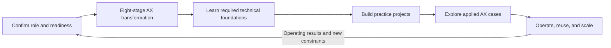

# AX Engineer Roadmap

[](../LICENSE)
[](README.md)
[](CHANGELOG.md)
[](https://github.com/woogi-kang/ax-engineer-roadmap/actions/workflows/validate.yml)
[](https://github.com/woogi-kang/ax-engineer-roadmap/actions/workflows/codeql.yml)
[](https://woogi-kang.github.io/ax-engineer-roadmap/en/)

[한국어](../README.md) | [English](README.md)

An **AX Engineer** finds work worth changing, redesigns the workflow, and connects AI to existing data, systems, and authority boundaries while taking responsibility for the path into operations.

In this repository, **AX** means **AI Transformation** of organizational workflows and their operating model. It is not presented as an industry-wide standardized abbreviation.

This repository turns that work into a public roadmap from workflow selection through deployment, adoption, recovery, and reuse. It also covers approval, authority, regulation, and digital-readiness conditions commonly encountered in Korean organizations.

> An AX Engineer's work does not end when the demo runs.
>
> The workflow must be usable in real work, stoppable and recoverable when it fails, and operable by someone other than its original builder.

## What you can get from this repository

- **A sequence for changing work**: move from goals and boundaries through redesign, data integration, controls, deployment, adoption, and scale in eight stages.
- **Implementation and operating criteria**: connect software, LLM, evaluation, and security skills to artifacts, approval, records, and recovery.
- **Applied cases by work area**: compare source systems and action boundaries across 15 cases, including cross-industry work and six industry contexts.
- **A public case catalog**: compare real workflows, human judgment, reported outcomes, and evidence limits across 10 Korean and 15 international cases.
- **A starting point by role**: find the decisions shared by practicing and aspiring AX Engineers, business practitioners, leaders, and data, security, and operations partners.

## What is verified now

| Asset | Count | Meaning of the published evidence |
|---|---:|---|
| Applied workflow cases | 15 | All pass the documentation and metadata checks |
| Reproducible public simulation | 1 | Code, evaluation, runbook, and hash manifest for 16 synthetic VOC records are regenerated in a clean directory |
| Design blueprints | 14 | Source systems, approvals, failures, and recovery are designed; executable code and organizational outcomes are not published |
| Public external cases | 10 Korean · 15 international | 26 source URLs are separated by provenance, deployment stage, and outcome verification |

`ready` means that the case documentation is ready for practice. It does not mean that organizational adoption, operating outcomes, or productivity, cost, and revenue effects were verified.

## Verify it with one command

```bash
git clone https://github.com/woogi-kang/ax-engineer-roadmap.git
cd ax-engineer-roadmap
npm run verify
```

This installs dependencies and Chromium, then runs the documentation, case, security-audit, Python-reproduction, site-rendering, browser-accessibility, and Pages-export checks in the same order as CI. `"verified": true` in the Python step confirms that the synthetic input, code, and committed outputs match.

- [Find a starting point by role and readiness](https://woogi-kang.github.io/ax-engineer-roadmap/en/)
- [Compare all 15 workflow cases](case-studies/README.md)
- [Explore 25 public AX cases](research/public-ax-cases.md)

## Interactive roadmap and quick start

[**Find your starting point in the interactive roadmap →**](https://woogi-kang.github.io/ax-engineer-roadmap/en/)

1. Review the [role model](roadmap/role-model.md) to understand the decisions and boundaries owned by an AX Engineer.
2. Use the [organization readiness diagnostic](start-here/organization-readiness.md) to place the workflow in a file-and-message, SaaS, or internal-system context.
3. Choose one applied case below where you can access the data and a safe test environment.

[Browse the Markdown guide](start-here/README.md) · [Run the site locally](../site/README.md)

## What work can you transform with AX?

Start with one case in a work area you already know. Open a case to see its systems of record, human approvals, external impact, and recovery path.

| Work area | Case | Starting condition | Designed target boundary |
|---|---|---|---|
| Customer and revenue | [Synthetic VOC issues → improvement proposals](case-studies/beauty-d2c-voc/README.md) | Synthetic VOC | Approved sandbox write |
| Customer and revenue | [Public petitions → cited drafts and clusters](case-studies/public-service-petition-response/README.md) | Synthetic petitions and policy | Draft only |
| People and collaboration | [Slack meetings → action items](case-studies/slack-meeting-actions/README.md) | SaaS sandboxes | Write after approval |
| People and collaboration | [Joiner, mover, and leaver access](case-studies/employee-lifecycle-access/README.md) | HR and identity sandboxes | Role-based approval |
| Finance and procurement | [Card transactions and receipts → journal-entry drafts](case-studies/corporate-card-expense/README.md) | Synthetic transactions and evidence | Draft only |
| Finance and procurement | [Electronic tax invoice issuance and payment reconciliation](case-studies/electronic-tax-invoice-reconciliation/README.md) | Accounting and ERP sandbox | Approved test issuance |
| Finance and procurement | [Vendor onboarding and bank-account change validation](case-studies/vendor-master-account-change/README.md) | Vendor-master sandbox | Dual approval |
| Finance and procurement | [Company evidence → credit and underwriting review](case-studies/credit-underwriting-review/README.md) | Synthetic applications and rules | Draft only |
| Data and operations | [Files and CSVs → reviewable work hub (AX Hub)](case-studies/file-csv-to-ax-hub/README.md) | Files and messaging | Draft only |
| Data and operations | [Inventory exceptions → purchase and transfer proposals](case-studies/inventory-exception-replenishment/README.md) | ERP and WMS sandboxes | Record approved proposals |
| Data and operations | [Equipment anomaly → maintenance proposal](case-studies/equipment-anomaly-maintenance/README.md) | Synthetic sensors and CMMS sandbox | Record approved proposal |
| Data and operations | [Care conversation → record and risk escalation](case-studies/care-conversation-record/README.md) | Fictional conversations and record sandbox | Draft and human escalation |
| Data and operations | [Evidence → source-linked regulated document](case-studies/regulated-evidence-document/README.md) | Synthetic contract and research material | Draft only |
| Shared operations | [Mail classification and response drafts](case-studies/centralized-mail-assist/README.md) | Mail sandbox | Approval before sending |
| Shared operations | [Multi-workflow agent operations](case-studies/company-agent-operating-layer/README.md) | Second workflow and internal APIs | Bounded by workflow |

The last column describes the **maximum boundary designed for practice**, not the currently implemented action. The Beauty/D2C case includes a reproducible synthetic VOC pipeline and evaluation results; all remaining cases are design blueprints. Compare current and target boundaries, readiness, risk, P1–P5, and evidence in the [full case catalog](case-studies/README.md).

To explore a broader set of workflow candidates from other organizations, use the [public AX case catalog](research/public-ax-cases.md). The [public case application map](research/public-case-application-map.md) shows how all 25 public sources reinforce 10 existing practices and shape five new ones. External reports are reference material, not independently verified operating outcomes.

Here, **AX Hub** means a thin work hub where reviewers can trace scattered files and CSVs to their source, owner, and review state. Do not infer a named company's internal diagnosis, live adoption, or productivity, cost, or revenue improvement from a case title.

## Roadmap structure



1. [Starting point](start-here/README.md): confirm your responsibility and the workflow's current readiness.
2. [Eight-stage AX transformation](delivery-lifecycle/README.md): move one workflow from discovery and redesign into operations.
3. [Technical foundations for AX Engineers](technical-foundations/README.md): learn software, LLMs, agents, evaluation, operations, and security.
4. [Practice projects](projects/README.md): progress from a safe assistant to reuse in a second workflow.
5. [Applied AX cases](case-studies/README.md): choose a case by readiness and risk, then practice P1–P5 as one flow.
6. [Operations and organizational scale](organization-maturity/README.md): assess whether the organization can repeat the same operating capability across workflows.

## Eight-stage AX workflow transformation

Proceed through the stages in order, returning to an earlier stage when operating results or new constraints require it.

| Stage | Core question | Document |
|---|---|---|
| 1. Goals and boundaries | What will change, and what must AI not do? | [Open](delivery-lifecycle/01-outcomes-and-boundaries.md) |
| 2. Understand the current workflow | How does the work actually flow, and where does it stall? | [Open](delivery-lifecycle/02-workflow-discovery.md) |
| 3. Workflow redesign | Are we automating work that should be removed or simplified? | [Open](delivery-lifecycle/03-process-redesign.md) |
| 4. Data and workflow context | Which systems hold current state, and do teams use terms consistently? | [Open](delivery-lifecycle/04-data-and-context.md) |
| 5. Execution rules and controls | What are the rules for input, output, authority, approval, records, and recovery? | [Open](delivery-lifecycle/05-execution-contracts.md) |
| 6. Deployment and operations | How does the prototype become a dependable workflow system? | [Open](delivery-lifecycle/06-production-deployment.md) |
| 7. Workflow transition and role change | What must change for the new flow to become official work? | [Open](delivery-lifecycle/07-adoption-and-change.md) |
| 8. Standardization and scale | What is actually reusable in a second workflow? | [Open](delivery-lifecycle/08-standardization-and-scale.md) |

## Five questions for assessing a competency

Knowing the concepts is not enough. For each competency, answer the following questions and support the answers with deliverables or operating records.

1. **Understand** — Can you explain the concepts and principles in your own words?
2. **Choose** — Can you explain why you chose an approach after comparing its constraints and risks?
3. **Apply** — Have you applied it under realistic data, authority, and exception conditions?
4. **Verify** — Did you leave a result or record that another person can review or reproduce?
5. **Handle failure** — Can you recognize common mistakes and failures, then stop or recover when needed?

Proficiency is based on delivery and operating responsibility rather than tenure or the number of tools used.

- **Foundation**: structure a workflow and validate a bounded prototype.
- **Builder**: deploy one workflow into a real operating environment.
- **Operator**: manage quality, cost, incidents, authority, and adoption over time.
- **Lead**: turn patterns repeated across workflows into shared organizational capability.

[Competency map](roadmap/competency-map.md) · [Proficiency levels](roadmap/proficiency-levels.md)

## Where to start

### Practicing or aspiring AX Engineer

1. Review the [role model](roadmap/role-model.md) and its responsibility boundaries.
2. Use the [organization readiness diagnostic](start-here/organization-readiness.md) to bound the first workflow.
3. Find gaps in the [technical foundations](technical-foundations/README.md).
4. Use the [12-week practice path](learning-paths/12-week-practice.md) to deploy one workflow and test reuse in a second.

### Business, leadership, data, security, and operations partners

Use the [collaboration role guides](tracks/README.md) to identify the decisions and deliverables you own with an AX Engineer. Writing code is not required, but responsibility for workflow criteria, data use, approval, operations, and stopping conditions still needs a named owner.

### Readers new to AI terminology

The [non-developer glossary](start-here/non-developer-glossary.md) explains LLMs, RAG, agents, MCP, evaluation, logs, and manual fallback through workflow decisions and risks.

## When to build a shared harness

A **shared harness** is the minimum set of operating rules and reusable tools that multiple workflows follow together.

Teams do not need to use the same model, framework, or interface. They do need compatible rules for:

- authoritative systems for current data;
- input and output formats and workflow identifiers;
- quality criteria and accountable approval;
- permission, change, version, and audit records;
- failure detection, stop, recovery, and manual handling;
- cost, quality, and workflow outcome review.

Do not turn the first implementation into an enterprise standard. Add only the rules and tools that are actually reused in a second workflow to the shared harness.

## What this roadmap does not cover

- rankings of models, clouds, or agent frameworks;
- an organization design in which AI performs every task;
- concentrating enterprise data and authority in one agent;
- unverified productivity, cost, or revenue claims;
- certification programs or hiring guarantees.

## How Korean organizational context is handled

Workflow discovery, redesign, integration, evaluation, and operations principles can travel across regions and industries. This repository adds conditions that often require explicit attention in Korean organizations:

- Does the formal approval line match actual decision authority?
- Who verifies current privacy and AI requirements?
- How different are data, API, and organization-account readiness across companies and teams?
- Does a tool purchase lead to changes in official procedure and accountability?
- Can data and work return safely when a vendor changes or a contract ends?

The roadmap does not treat Korean companies as one culture. Readers elsewhere can replace legal, procurement, labor, and organizational conditions with their local context.

## Role signals from public job material

`AX Engineer` is not yet a standardized title. Korean job material checked on 2026-07-31 combined workflow analysis, AI, data and cloud implementation, existing-system integration, evaluation, operations, security, and internal adoption in different ways. The change-prone source postings and evidence bounds are maintained in the [public AX Engineer role review](research/ax-engineer-role-review.md).

## Contributing

The [public AX case catalog](research/public-ax-cases.md) compares 25 Korean and international cases through a workflow-and-control lens. [AX Engineer public role review](research/ax-engineer-role-review.md) summarizes recurring responsibilities in current role and practitioner material. [Developer and AI Agents roadmap review](research/roadmap-benchmark-review.md) records what this project borrows from roadmap.sh and what it adds for AX work.

- Propose outdated or incorrect material through a `Source update` issue.
- Open a `Roadmap gap` issue for missing competencies or stages.
- Submit de-identified cases through a `Case study proposal`.
- Follow the [contribution guide](CONTRIBUTING.md) and [source policy](research/source-policy.md).

[Support](SUPPORT.md) · [Security](SECURITY.md) · [Governance](GOVERNANCE.md) · [Code of Conduct](CODE_OF_CONDUCT.md) · [Changelog](CHANGELOG.md) · [Citation](../CITATION.cff)

## Maintainer note

This project began with a product engineer's need to make the gap between building an AI feature and changing a real organizational workflow explicit. Maintainer [Woogi](https://github.com/woogi-kang) builds and verifies the case documents and runnable artifacts, while separating simulations from any claim that would require operating or business evidence.

## Status and license

- Latest published release: `v0.3.0`
- Next release candidate: `v0.4.0`
- Reference date: `2026-08-01`
- Status: `v0.4.0` release candidate. Local changes are not on the public site until they reach `main` and the Pages deployment finishes.
- Scope: reusable AX principles plus conditions to verify in Korean organizations
- License: [MIT](../LICENSE)
