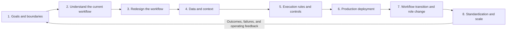

# Eight-Stage AX Workflow Transformation

## Purpose

This sequence moves one workflow from selection and redesign into operations and reuse.

The stages are not a validated industry standard or compliance certification. They are a practical order for checking decisions and deliverables that AX efforts often miss. Proceed in order, returning to earlier stages when operating results or new constraints require it.

## How to use it

- Do not fully document all eight stages before learning anything.
- Start with a small, low-risk scope and record the results.
- Do not raise autonomous execution when data, permissions, or recovery are not ready.
- Return to an earlier stage when operations reveal a new constraint.
- Do not force implementation when a stage's exit criteria are unmet.

## Stages

1. [Goals and boundaries](01-outcomes-and-boundaries.md)
2. [Understand the current workflow](02-workflow-discovery.md)
3. [Redesign the workflow](03-process-redesign.md)
4. [Data and context](04-data-and-context.md)
5. [Execution rules and controls](05-execution-contracts.md)
6. [Production deployment](06-production-deployment.md)
7. [Workflow transition and role change](07-adoption-and-change.md)
8. [Standardization and scale](08-standardization-and-scale.md)

## Shared completion questions

- Who uses the workflow outcome, and who is ultimately accountable?
- Can another person inspect the input and output?
- Are prohibited AI actions and human approval points explicit?
- Can failures be detected, stopped, and recovered?
- Do the recorded results show whether the new workflow is better than the old one?
- Can operating responsibility be handed over?
- Have reusable and disposable parts been distinguished for the next workflow?
