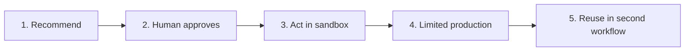

# Practice Projects for AX Engineers

These projects increase workflow impact and the AX Engineer's delivery responsibility step by step. Do not increase autonomy or live-system impact until the prior project's exit criteria are met.

## Project sequence

| Stage | Project | Action scope | Result to verify |
|---|---|---|---|
| 1 | [Safe Assistant](01-safe-assistant.md) | Public or synthetic data, no external action | Eval set, provenance, refusal |
| 2 | [Human-Approved Workflow](02-human-approved-workflow.md) | Record only approved proposed actions | Approval criteria, before and after, audit |
| 3 | [Sandbox Integration](03-sandbox-integration.md) | Read and write in test systems | Permission separation, deduplication, recovery |
| 4 | [Production Pilot](04-production-pilot.md) | Limited users and workflow | SLO, adoption, incidents, handoff |
| 5 | [Second-Workflow Reuse](05-second-workflow-reuse.md) | Reuse of validated rules and components | Reuse comparison, versioning, and standardization decision |

## Two ways to complete the projects

### Organization track

Actual workflow owners and users participate, using organizational test and production environments and approval processes. Follow current policy and owner approval for personal, confidential, customer, or financial data.

### Public simulation track

Use public or synthetic data and an isolated environment. Publish assumptions, test scope, and unverified areas. Do not claim production adoption, organizational impact, or official process change.

Non-developers can produce equivalent decisions and evidence through documents, tables, no-code sandboxes, and role-play. State clearly when no external action occurred.

## Case-to-project paths

The [applied AX cases](../case-studies/README.md) apply the same P1–P5 exit criteria to different workflows and systems.

| Case | P1 assist | P2 approval | P3 sandbox | P4 limited operations | P5 reuse |
|---|---|---|---|---|---|
| [Beauty/D2C VOC](../case-studies/beauty-d2c-voc/README.md) | Classify and summarize | Action proposal | Create work item | — | Compare another market or channel |
| [Files and CSV → AX Hub](../case-studies/file-csv-to-ax-hub/README.md) | Organize material | Review Hub update | Structured storage | — | Compare a second material flow |
| [Slack meeting signals → actions](../case-studies/slack-meeting-actions/README.md) | Pre-meeting brief | Approve actions | Create work items | Bounded team | Second meeting type |
| [Centralized mail assistance](../case-studies/centralized-mail-assist/README.md) | Classify and draft | Approve outbound mail | Test mailbox | Selected shared inbox | Second mail workflow |
| [Company Agent Operating Layer](../case-studies/company-agent-operating-layer/README.md) | Reuse prior results | Shared policy decision | Isolated runtime | Two bounded workflows | Standardize or retire |

`—` means that the current public-simulation scope does not perform P4. It does not indicate verified production outcomes.

## Common submission package

- Problem, user, and baseline
- Current and target workflow
- Scope, non-goals, and prohibited actions
- Data provenance, ownership, and missingness
- Input, output, evaluation, approval, record, and recovery contracts
- Normal, edge, and failed cases
- Decision, change, and failure records
- Outcomes, limits, and claims not made

Templates:

- [Experiment Card](../toolkit/experiment-card.md)
- [Workflow Execution Rules](../toolkit/execution-contract.md)
- [Evidence Ledger](../toolkit/evidence-ledger.md)
- [Case Study](../toolkit/case-study-template.md)

## Exit rule

Another person must verify each project's exit criteria. The implementer cannot be the sole completion judge. A failed project still provides a valid result when stop conditions were honored and the next decision is explainable.
