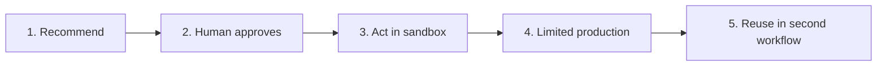

# Evidence-Based Practice Projects

These projects expand delivery responsibility step by step rather than increasing feature complexity. Do not increase autonomy or live-system impact until the prior project's exit criteria are met.

## Project sequence

| Stage | Project | Action scope | Core evidence |
|---|---|---|---|
| 1 | [Safe Assistant](01-safe-assistant.md) | Public or synthetic data, no external action | Eval set, provenance, refusal |
| 2 | [Human-Approved Workflow](02-human-approved-workflow.md) | Record only approved proposed actions | Approval criteria, before and after, audit |
| 3 | [Sandbox Integration](03-sandbox-integration.md) | Read and write in test systems | Permission separation, deduplication, recovery |
| 4 | [Production Pilot](04-production-pilot.md) | Limited users and workflow | SLO, adoption, incidents, handoff |
| 5 | [Second-Workflow Reuse](05-second-workflow-reuse.md) | Reuse of validated contracts | Reuse comparison, version and extension decision |

## Two ways to complete the projects

### Organization track

Actual workflow owners and users participate, using organizational test and production environments and approval processes. Follow current policy and owner approval for personal, confidential, customer, or financial data.

### Public simulation track

Use public or synthetic data and an isolated environment. Publish assumptions, test scope, and unverified areas. Do not claim production adoption, organizational impact, or official process change.

Non-developers can produce equivalent decisions and evidence through documents, tables, no-code sandboxes, and role-play. State clearly when no external action occurred.

## Common submission package

- Problem, user, and baseline
- Current and target workflow
- Scope, non-goals, and prohibited actions
- Data provenance, ownership, and missingness
- Input, output, evaluation, approval, record, and recovery contracts
- Normal, edge, and failed cases
- Decision, change, and failure records
- Outcomes, limits, and claims not made

Templates:

- [Experiment Card](../toolkit/experiment-card.md)
- [Execution Contract](../toolkit/execution-contract.md)
- [Evidence Ledger](../toolkit/evidence-ledger.md)
- [Case Study](../toolkit/case-study-template.md)

## Exit rule

Another person must verify each project's exit criteria. The implementer cannot be the sole completion judge. A failed project is still valid evidence when stop conditions were honored and the next decision is explainable.
