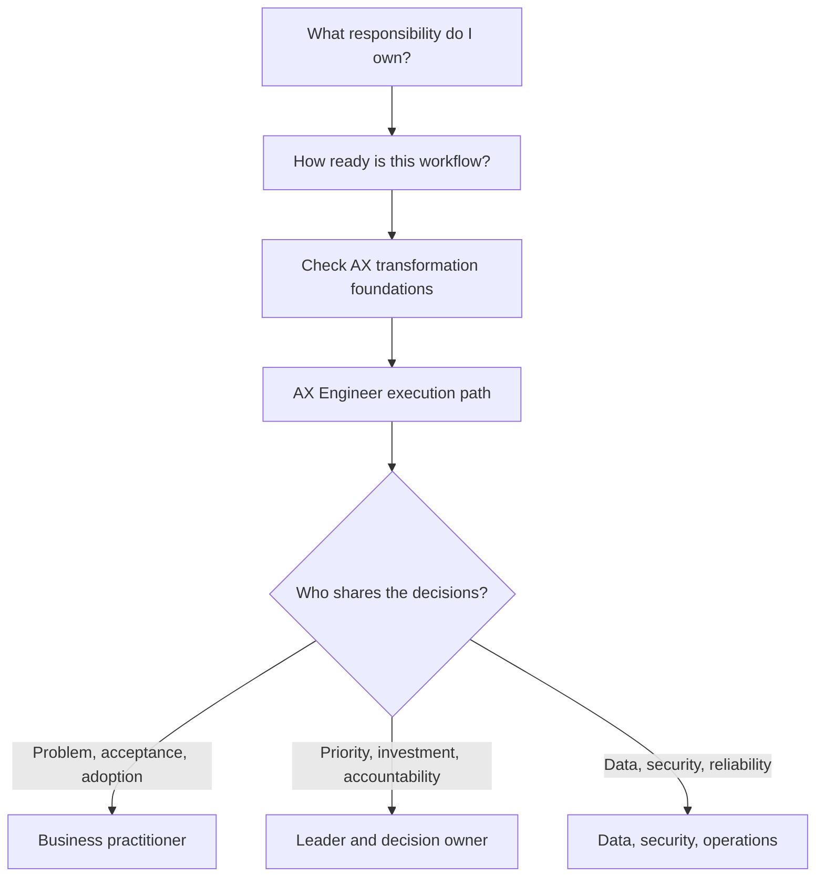

# Start Here

Begin by confirming the AX Engineer's responsibility and the workflow's current readiness. Then identify the technical gaps and the partners who own business, leadership, data, security, and operations decisions.

## 1. Confirm the responsibility

[Persona Selector](persona-selector.md) uses the decisions made in the current workflow rather than job titles. One person may carry several responsibilities in a small organization, but each decision still needs an explicit owner.

## 2. Assess workflow readiness

[Organization Readiness](organization-readiness.md) checks workflow records, authoritative systems, permissions, and operating ownership. Readiness is not a score of organizational quality and may differ across workflows in the same company.

## 3. Check AX transformation foundations

Every role should be able to answer:

- Is this a workflow problem or an AI problem?
- Can we map the current flow, waiting, exceptions, and handoffs?
- Which steps should be removed or standardized, and which still require accountable judgment?
- Where is current state authoritative, and what data, missingness, and terminology differences exist?
- Who judges acceptable and failed outcomes, using what criteria?
- Are prohibited actions, approval points, stop, recovery, and manual fallback defined?
- Are usage and workflow outcomes measured separately?
- Can another person inspect decisions, changes, approvals, and failures?

If many answers are unclear, begin with [Outcomes and boundaries](../delivery-lifecycle/01-outcomes-and-boundaries.md), [Workflow discovery](../delivery-lifecycle/02-workflow-discovery.md), and [Data and workflow context](../delivery-lifecycle/04-data-and-context.md).

## 4. Follow the AX Engineer path and collaboration guides

| Primary responsibility | Recommended document |
|---|---|
| Software, AI, integration, deployment | [AX Engineer execution path](../tracks/ax-builder.md) |
| Workflow definition, acceptance, SOP, adoption | [Business practitioner guide](../tracks/business-practitioner.md) |
| Portfolio, investment, accountability | [Leader and decision-owner guide](../tracks/leader-and-governance.md) |
| Data, privacy, security, incident response | [Data, security, and operations guide](../tracks/data-security-operations.md) |

## 5. Verify results through projects

[Practice projects](../projects/README.md) progress from a safe assistant to reuse in a second workflow. Without an organizational development environment, use documents, tables, sandbox simulation, and independent review while making the simulation boundary explicit.

## If the terminology is unfamiliar

The [non-developer glossary](non-developer-glossary.md) explains APIs, RAG, agents, MCP, evaluation, logs, and manual fallback through workflow decisions and risks.
