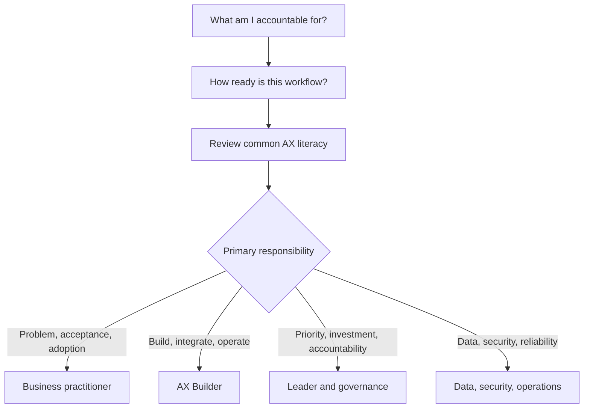

# Start Here

You do not need to read this roadmap from beginning to end. Identify your role and the readiness of the target workflow, review the common AX foundation, and then enter the relevant track.

## 1. Select your role

[Persona Selector](persona-selector.md) uses the decisions you own in the current workflow rather than your job title. One person may need more than one track.

## 2. Assess organizational readiness

[Organization Readiness](organization-readiness.md) checks workflow records, source systems, permissions, and operating ownership. Readiness is not organizational quality or AX maturity. It can differ by workflow within the same company.

## 3. Review common AX literacy

Every role should be able to answer:

- Is this a workflow problem or an AI problem?
- Can we map the flow, wait time, exceptions, and handoffs?
- Which steps should be removed or standardized, and where should human judgment remain?
- What is the source of truth, and what are the provenance, missingness, and terminology risks?
- Who judges good and failed outcomes, using which criteria?
- What actions are prohibited, where is approval required, and how do we stop, recover, and fall back?
- Are usage and workflow outcomes measured separately?
- Can another person inspect decisions, changes, approvals, and failures?

If many answers are unclear, begin with [Outcomes and boundaries](../delivery-lifecycle/01-outcomes-and-boundaries.md), [Workflow discovery](../delivery-lifecycle/02-workflow-discovery.md), and [Data and context](../delivery-lifecycle/04-data-and-context.md).

## 4. Enter a role-based track

| Primary responsibility | Recommended track |
|---|---|
| Workflow definition, acceptance, SOP, adoption | [Business Practitioner](../tracks/business-practitioner.md) |
| Software, AI, integration, deployment | [AX Builder](../tracks/ax-builder.md) |
| Portfolio, investment, accountability | [Leader and Governance](../tracks/leader-and-governance.md) |
| Data, privacy, security, incident response | [Data, Security, and Operations](../tracks/data-security-operations.md) |

## 5. Prove it through projects

[Practice Projects](../projects/README.md) progress from a safe assistant to reuse in a second workflow. Readers without a development environment can produce equivalent decisions and evidence through documents, tables, sandboxes, and simulations.

## If the terminology is unfamiliar

[AX Glossary for Non-Developers](non-developer-glossary.md) explains APIs, RAG, agents, MCP, evaluation, logs, and manual fallback in workflow terms.
