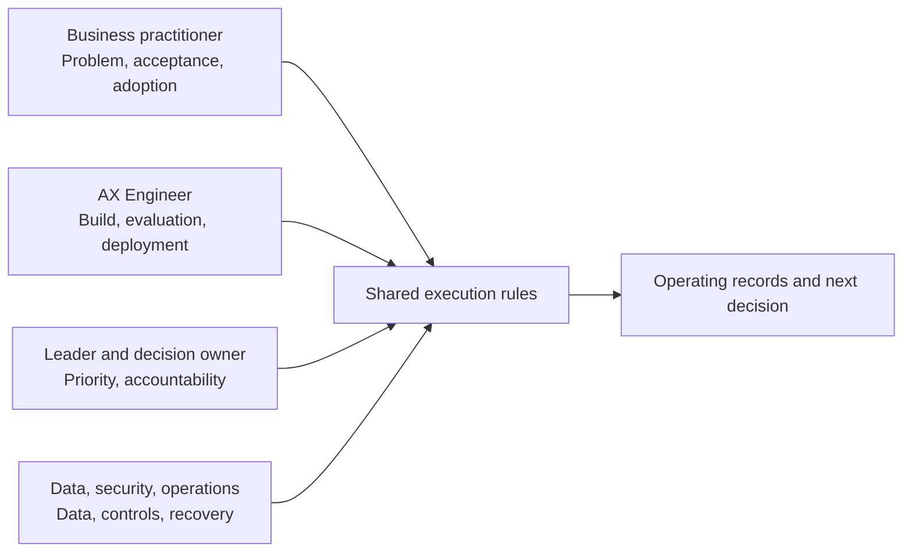

# Collaboration Role Guides for AX Engineers

This roadmap is primarily for AX Engineers, but transforming one workflow requires decisions from business, leadership, data, security, and operations partners. This directory separates the AX Engineer's execution path from the responsibilities of three collaboration groups.

## Foundations shared by every role

Every role should be able to:

1. distinguish a workflow problem from an AI problem;
2. inspect the current flow, waiting, exceptions, and handoffs;
3. separate removal, simplification, standardization, accountable judgment, AI assistance, and automatic action;
4. identify source data, provenance, missingness, terminology, and ownership;
5. define normal, edge, and failure outcomes and name the judge;
6. define prohibited actions, approval, stop, recovery, and manual fallback;
7. measure usage separately from workflow outcomes;
8. retain decisions, changes, approvals, and failure records.

If these questions are unclear, begin with [Start Here](../start-here/README.md) and the [Eight-Stage AX Transformation Lifecycle](../delivery-lifecycle/README.md).

## AX Engineer and collaboration roles

| Guide | Primary responsibility | Representative deliverables |
|---|---|---|
| [AX Engineer](ax-builder.md) | Build, integration, evaluation, deployment, operations | Code, execution rules, eval results, logs, recovery drills |
| [Business practitioner](business-practitioner.md) | Workflow definition, acceptance, exceptions, SOP, adoption | Current and target flows, acceptance criteria, UAT, SOP |
| [Leader and decision owner](leader-and-governance.md) | Priority, investment, accountability, procurement, scale | Portfolio decisions, ownership matrix, investment and stop criteria |
| [Data, security, and operations partner](data-security-operations.md) | Data, privacy, permissions, incidents, audit | Data map, permission matrix, threat model, incident-response records |

## How the roles work together

Shared execution rules should cover outcomes, input and output, source data, permissions, evaluation, approval, stop, recovery, records, and named owners. The [Workflow Execution Rules Template](../toolkit/execution-contract.md) provides a starting point.

## How to use these guides

These are not four separate career roadmaps. The AX Engineer uses them to understand what each partner decides, while each partner prepares the criteria and deliverables within their responsibility. Not every role writes code, but every deployment, operating, and stopping decision still needs accountable evidence.
