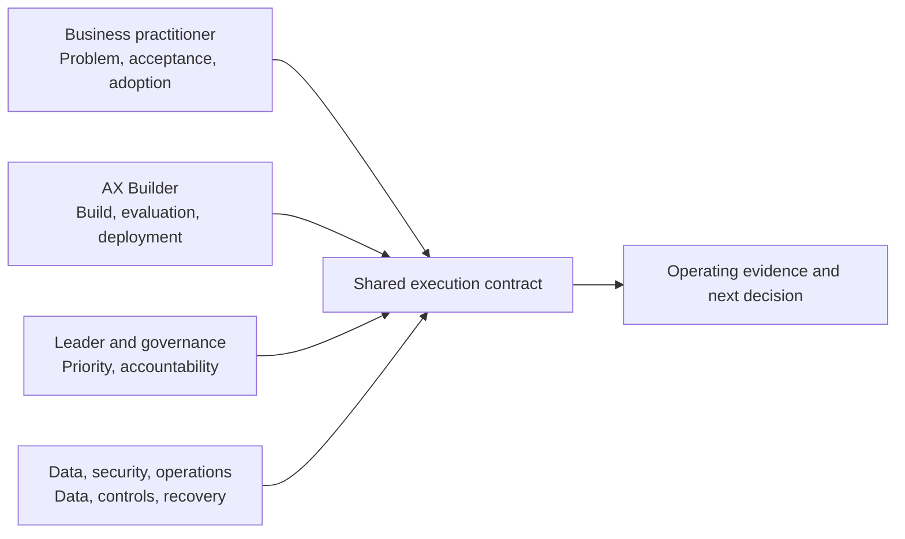

# Role-Based Learning Tracks

AX is not completed by one job function. These four tracks teach the same workflow transformation from different responsibilities.

## Common AX literacy

All tracks share these judgments:

1. Distinguish workflow problems from AI problems.
2. Inspect current flow, wait time, exceptions, and handoffs.
3. Separate removal, simplification, standardization, human judgment, AI assistance, and automated action.
4. Confirm source data, provenance, missingness, terminology, and ownership.
5. Define normal, edge, and failed outcomes and who judges them.
6. Design prohibited actions, approval, stopping, recovery, and fallback.
7. Measure usage and workflow outcomes separately.
8. Preserve decisions, changes, approvals, and failures.

If these foundations are unclear, begin with [Start Here](../start-here/README.md) and the [Eight-Stage Workflow Transformation Lifecycle](../delivery-lifecycle/README.md).

## Four tracks

| Track | Primary responsibility | Representative evidence |
|---|---|---|
| [Business Practitioner](business-practitioner.md) | Workflow definition, acceptance, exceptions, SOP, adoption | Current and target flows, acceptance criteria, UAT, SOP |
| [AX Builder](ax-builder.md) | Build, integration, evaluation, deployment, operations | Code, contracts, eval results, logs, recovery drills |
| [Leader and Governance](leader-and-governance.md) | Priority, investment, accountability, procurement, scale | Portfolio decisions, ownership matrix, invest and stop criteria |
| [Data, Security, and Operations](data-security-operations.md) | Data, privacy, permissions, incidents, audit | Data map, permission matrix, threat model, incident records |

## How the tracks work together

The shared execution contract should include outcomes, input and output, source data, permissions, evaluation, approval, stop, recovery, records, and owners. Start with the [Execution Contract Template](../toolkit/execution-contract.md).

## What completion means

Completion means producing evidence another person can inspect within your responsibility—not merely reading the documents. Not every role needs to write code, but every role must provide evidence required for deployment, operations, or stopping decisions.
