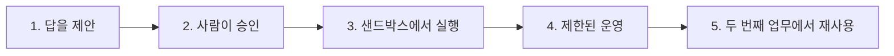

# 증거 중심 실습 프로젝트

이 프로젝트들은 기능의 화려함보다 배포 책임의 범위를 단계적으로 넓힌다. 앞 프로젝트의 통과 기준을 충족하지 못했다면 자율성과 실제 시스템 영향을 높이지 않는다.

## 프로젝트 순서

| 단계 | 프로젝트 | 실행 범위 | 핵심 증거 |
|---|---|---|---|
| 1 | [안전한 보조 도구](01-safe-assistant.md) | 공개·합성 데이터, 외부 실행 없음 | 평가 세트, 출처, 거절 |
| 2 | [사람 승인 워크플로우](02-human-approved-workflow.md) | 제안 후 승인된 실행만 기록 | 승인 기준, 변경 전후, 감사 기록 |
| 3 | [샌드박스 통합](03-sandbox-integration.md) | 테스트 시스템 읽기·쓰기 | 권한 분리, 중복 방지, 복구 |
| 4 | [운영 파일럿](04-production-pilot.md) | 제한된 실제 사용자·업무 | SLO, 채택, 장애, 인수인계 |
| 5 | [두 번째 업무 재사용](05-second-workflow-reuse.md) | 검증된 계약의 재사용 | 재사용 비교, 버전·확장 결정 |

## 두 가지 수행 방식

### 조직 실전

실제 업무 책임자와 사용자가 참여하고, 조직의 테스트·운영 환경과 승인 절차를 사용한다. 개인정보·기밀·고객 영향이 있으면 현재 정책과 담당자 승인을 따른다.

### 공개 시뮬레이션

공개·합성 데이터와 격리된 환경을 사용한다. 가정, 시험 범위, 실제로 검증하지 못한 부분을 공개한다. 운영 채택, 조직 성과, 공식 절차 변경을 주장하지 않는다.

비개발자는 문서, 표, 노코드 샌드박스, 수동 역할극으로 같은 판단과 증거를 만들 수 있다. 실제 외부 실행이 없다는 사실을 명시한다.

## 모든 프로젝트의 공통 제출물

- 문제, 사용자, 기준선
- 현재·목표 업무 흐름
- 범위, 비목표, 금지 행동
- 데이터 출처·소유자·누락
- 입력·출력·평가·승인·기록·복구 계약
- 정상·경계·실패 사례와 결과
- 결정·변경·실패 기록
- 성과, 한계, 주장하지 않는 내용

도구:

- [실험 카드](../toolkit/experiment-card.md)
- [실행 계약](../toolkit/execution-contract.md)
- [근거 기록](../toolkit/evidence-ledger.md)
- [사례 문서](../toolkit/case-study-template.md)

## 통과 규칙

프로젝트마다 통과 기준을 다른 사람이 확인한다. 구현자가 혼자 “완료”로 판정하지 않는다. 실패 증거가 남았더라도 중단 조건을 지키고 다음 결정을 설명할 수 있다면 유효한 결과다.
