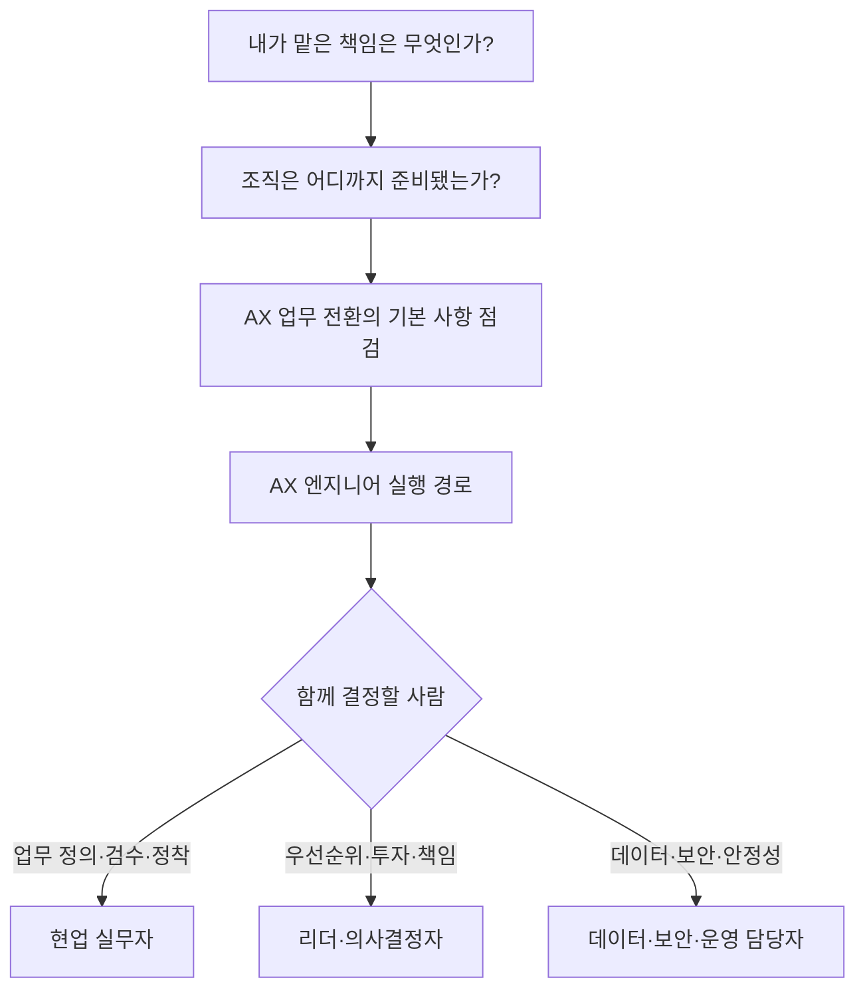

# 여기서 시작하기

먼저 AX 엔지니어의 책임과 현재 업무의 준비 상태를 확인한다. 이후 부족한 기술을 학습하고, 협업할 담당자가 무엇을 결정해야 하는지 찾아본다.

## 1. 맡은 책임을 확인한다

[역할 선택 안내](persona-selector.md)는 직함이 아니라 이번 업무에서 자신이 실제로 내리는 결정을 기준으로 역할을 찾도록 돕는다. 작은 조직에서는 한 사람이 여러 책임을 함께 맡을 수 있다.

## 2. 조직 준비도를 확인한다

[조직 준비도 진단](organization-readiness.md)은 현재 업무 기록, 원본 시스템, 권한, 운영 책임을 확인한다. 준비도는 AX 성숙도나 조직의 우열이 아니다. 같은 회사에서도 업무마다 다를 수 있다.

## 3. AX 업무 전환의 기본 사항을 확인한다

모든 역할은 다음 질문에 답할 수 있어야 한다.

- 지금 겪는 문제가 업무 문제인지 AI 문제인지 구분했는가?
- 현재 흐름, 대기, 예외, 인수인계를 그릴 수 있는가?
- 없애거나 표준화할 단계와 담당자가 판단할 단계를 구분했는가?
- 최신 상태를 확인할 원본, 데이터 출처, 누락, 용어 차이를 확인했는가?
- 좋은 결과와 실패 결과를 누가 어떤 기준으로 판정하는가?
- 금지 행동, 승인 지점, 중단·복구·수동 대체가 정해졌는가?
- 사용량과 실제 업무 결과를 따로 측정하는가?
- 결정·변경·승인·실패 기록을 다른 사람이 확인할 수 있는가?

막히는 항목이 많다면 구현보다 [목표와 경계](../delivery-lifecycle/01-outcomes-and-boundaries.md), [현재 업무 파악](../delivery-lifecycle/02-workflow-discovery.md), [데이터와 업무 맥락](../delivery-lifecycle/04-data-and-context.md)부터 시작한다.

## 4. AX 엔지니어 경로와 협업 역할을 확인한다

| 주된 책임 | 추천 문서 |
|---|---|
| 소프트웨어, AI, 통합, 배포 | [AX 엔지니어](../tracks/ax-builder.md) |
| 현업 문제 정의, 검수, SOP, 현업 정착 | [현업 실무자](../tracks/business-practitioner.md) |
| 포트폴리오, 투자, 책임 체계 | [리더·의사결정자](../tracks/leader-and-governance.md) |
| 데이터, 개인정보, 보안, 장애 대응 | [데이터·보안·운영 담당자](../tracks/data-security-operations.md) |

## 5. 프로젝트로 결과를 확인한다

[실습 프로젝트](../projects/README.md)는 안전한 보조 도구부터 두 번째 업무 재사용까지 다섯 단계로 이어진다. 개발 환경이 없다면 문서·표·샌드박스 시뮬레이션으로 같은 판단 과정을 연습하고 결과를 남길 수 있다.

## 용어가 낯설다면

[비개발자를 위한 용어 안내](non-developer-glossary.md)에서 API, RAG, 에이전트(Agent), MCP, 평가, 로그, 수동 대체 같은 말을 업무 장면에 맞춰 설명한다.
