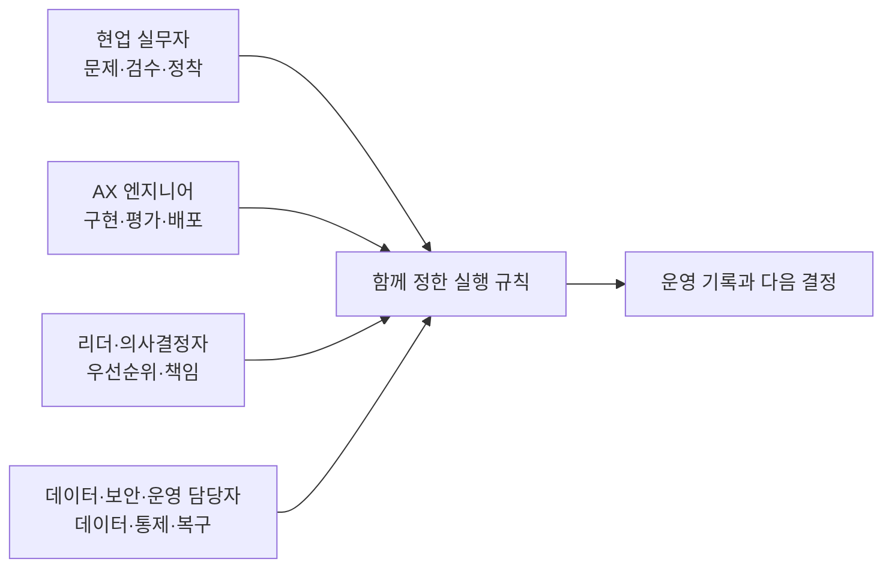

# AX 엔지니어의 협업 역할 안내

이 로드맵의 주 독자는 AX 엔지니어지만, 한 업무를 AX로 전환하려면 현업·리더·데이터·보안·운영 담당자와 함께 결정해야 한다. 이 디렉터리는 AX 엔지니어의 실행 경로와 세 협업 역할의 책임을 나눠 설명한다.

## 모든 역할이 알아야 할 기본 사항

역할은 달라도 다음 판단은 함께 확인한다.

1. 업무 문제와 AI 문제를 구분한다.
2. 현재 흐름, 대기, 예외, 인수인계를 확인한다.
3. 제거·단순화·표준화·담당자 판단·AI 보조·자동 실행을 구분한다.
4. 원본 데이터, 출처, 누락, 용어, 소유자를 확인한다.
5. 정상·경계·실패 결과와 판정자를 정한다.
6. 금지 행동, 승인, 중단, 복구, 수동 대체를 설계한다.
7. 사용량과 업무 결과를 따로 측정한다.
8. 결정·변경·승인·실패 기록을 남긴다.

답하기 어려운 항목이 많다면 [시작점 안내](../start-here/README.md)와 [AX 업무 전환 8단계](../delivery-lifecycle/README.md)를 먼저 본다.

## AX 엔지니어와 협업 역할

| 역할 안내 | 주된 책임 | 대표 결과물 |
|---|---|---|
| [AX 엔지니어](ax-builder.md) | 구현, 통합, 평가, 배포, 운영 | 코드, 실행 규칙, 평가 결과, 로그, 복구 훈련 |
| [현업 실무자](business-practitioner.md) | 업무 정의, 검수, 예외, SOP, 현업 정착 | 현재/목표 흐름, 검수 기준, 사용자 검수, SOP |
| [리더·의사결정자](leader-and-governance.md) | 우선순위, 투자, 책임, 조달, 확장 | 포트폴리오 결정, 책임표, 투자·중단 기준 |
| [데이터·보안·운영 담당자](data-security-operations.md) | 데이터, 개인정보, 권한, 장애, 감사 | 데이터 관계도, 권한표, 위협 모델, 사고 대응 기록 |

## 함께 일하는 방식

함께 정한 실행 규칙에는 최소한 목표, 입력·출력, 원본 데이터, 권한, 평가, 승인, 중단, 복구, 기록, 책임자를 넣는다. [업무 실행 규칙 템플릿](../toolkit/execution-contract.md)을 출발점으로 사용할 수 있다.

## 역할 안내를 활용하는 방법

각 문서는 별도의 직무 로드맵이 아니다. AX 엔지니어는 협업 상대가 무엇을 결정하는지 확인하고, 협업자는 자신의 책임 범위에서 필요한 기준과 결과물을 준비한다. 모든 역할이 코드를 만들 필요는 없지만 배포·운영·중단 결정에 필요한 근거는 각 책임자가 제공해야 한다.
