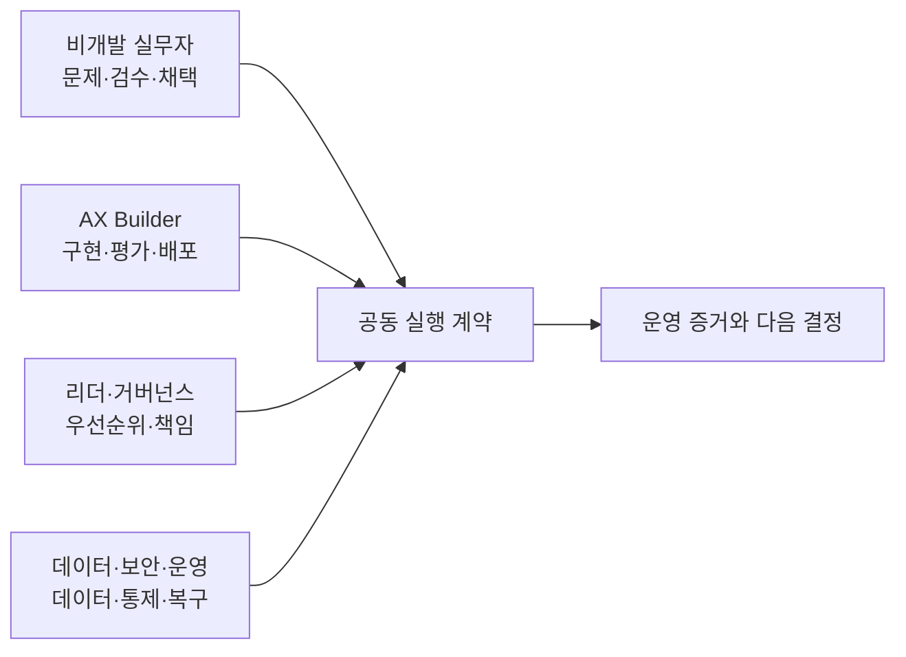

# 역할별 학습 트랙

AX는 한 직무가 혼자 끝내는 일이 아니다. 이 디렉터리는 같은 업무 전환을 서로 다른 책임에서 학습하도록 네 트랙으로 나눈다.

## 모든 역할의 공통 소양

네 트랙은 다음 판단을 공유한다.

1. 업무 문제와 AI 문제를 구분한다.
2. 현재 흐름, 대기, 예외, 인수인계를 확인한다.
3. 제거·단순화·표준화·사람 판단·AI 보조·자동 실행을 구분한다.
4. 원본 데이터, 출처, 누락, 용어, 소유자를 확인한다.
5. 정상·경계·실패 결과와 판정자를 정한다.
6. 금지 행동, 승인, 중단, 복구, 수동 대체를 설계한다.
7. 사용량과 업무 결과를 따로 측정한다.
8. 결정·변경·승인·실패 기록을 남긴다.

공통 소양에서 막히면 [시작점 안내](../start-here/README.md)와 [8단계 업무 전환 생애주기](../delivery-lifecycle/README.md)를 먼저 본다.

## 네 트랙

| 트랙 | 주된 책임 | 대표 증거 |
|---|---|---|
| [비개발 실무자](business-practitioner.md) | 업무 정의, 검수, 예외, SOP, 채택 | 현재/목표 흐름, 검수 기준, 사용자 검수, SOP |
| [AX Builder](ax-builder.md) | 구현, 통합, 평가, 배포, 운영 | 코드, 계약, 평가 결과, 로그, 복구 훈련 |
| [리더·거버넌스](leader-and-governance.md) | 우선순위, 투자, 책임, 조달, 확장 | 포트폴리오 결정, 책임표, 투자·중단 기준 |
| [데이터·보안·운영](data-security-operations.md) | 데이터, 개인정보, 권한, 장애, 감사 | 데이터 지도, 권한표, 위협 모델, 사고 대응 기록 |

## 함께 일하는 방식

공동 실행 계약에는 최소한 목표, 입력·출력, 원본 데이터, 권한, 평가, 승인, 중단, 복구, 기록, 책임자를 넣는다. [실행 계약 템플릿](../toolkit/execution-contract.md)을 출발점으로 사용한다.

## 트랙 완료의 뜻

문서를 읽은 상태가 아니라, 자신의 책임 범위에서 다음 사람이 확인할 증거를 만든 상태다. 모든 역할이 코드를 만들 필요는 없지만, 모든 역할은 배포·운영·중단 결정에 필요한 근거를 제공해야 한다.
